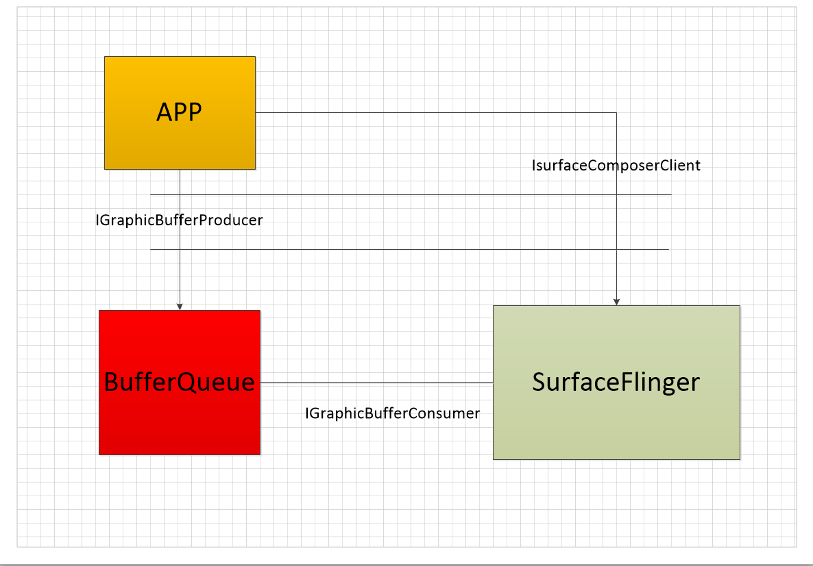
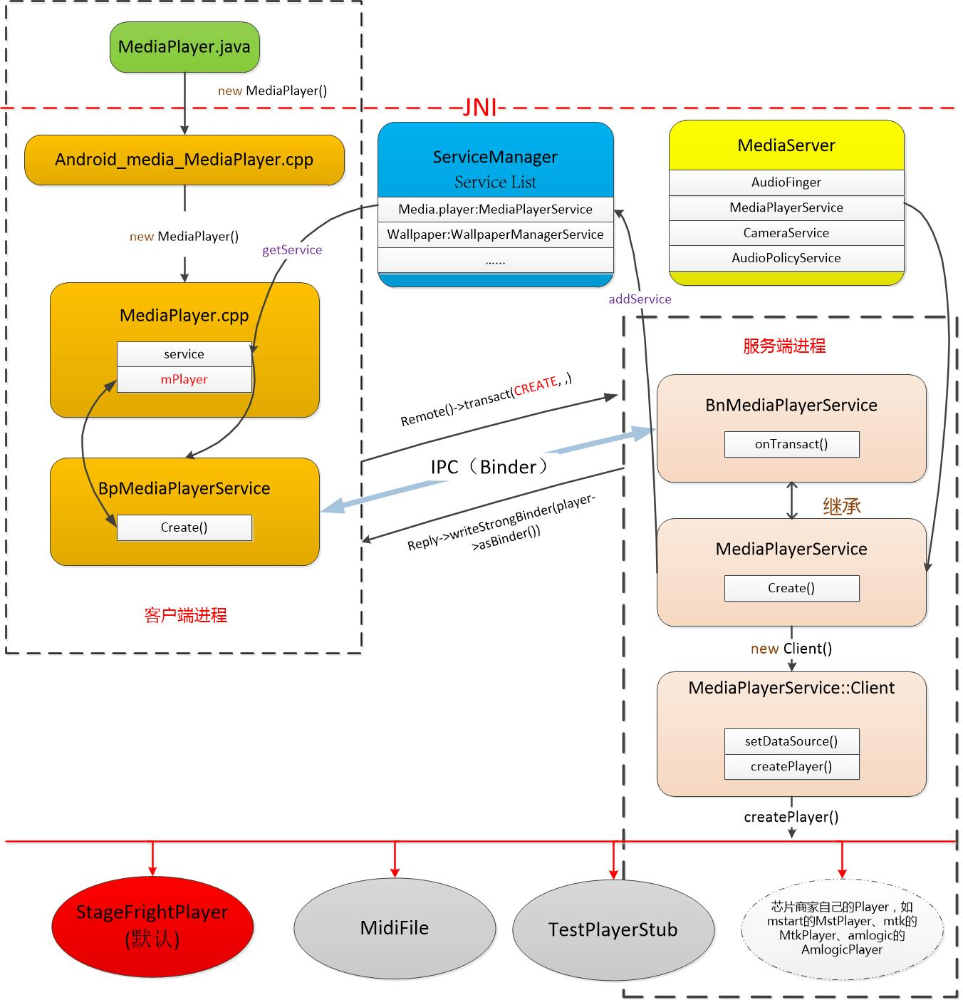
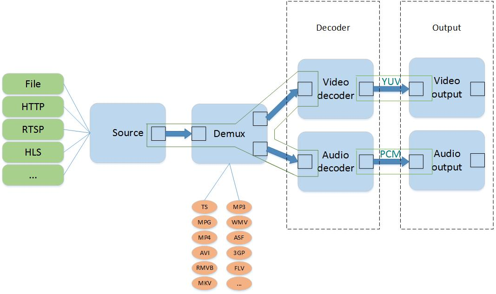
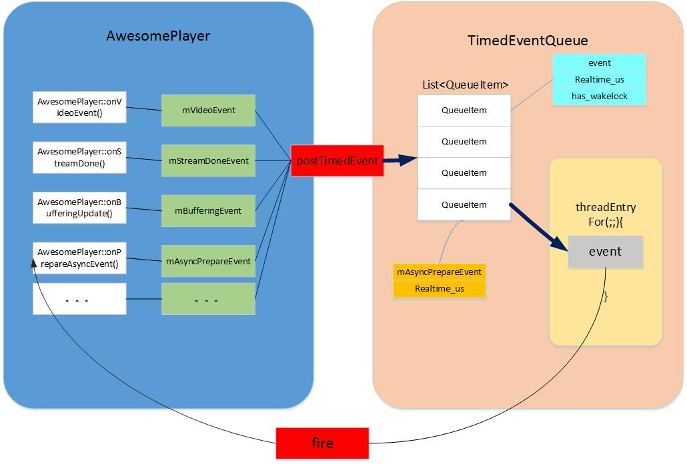
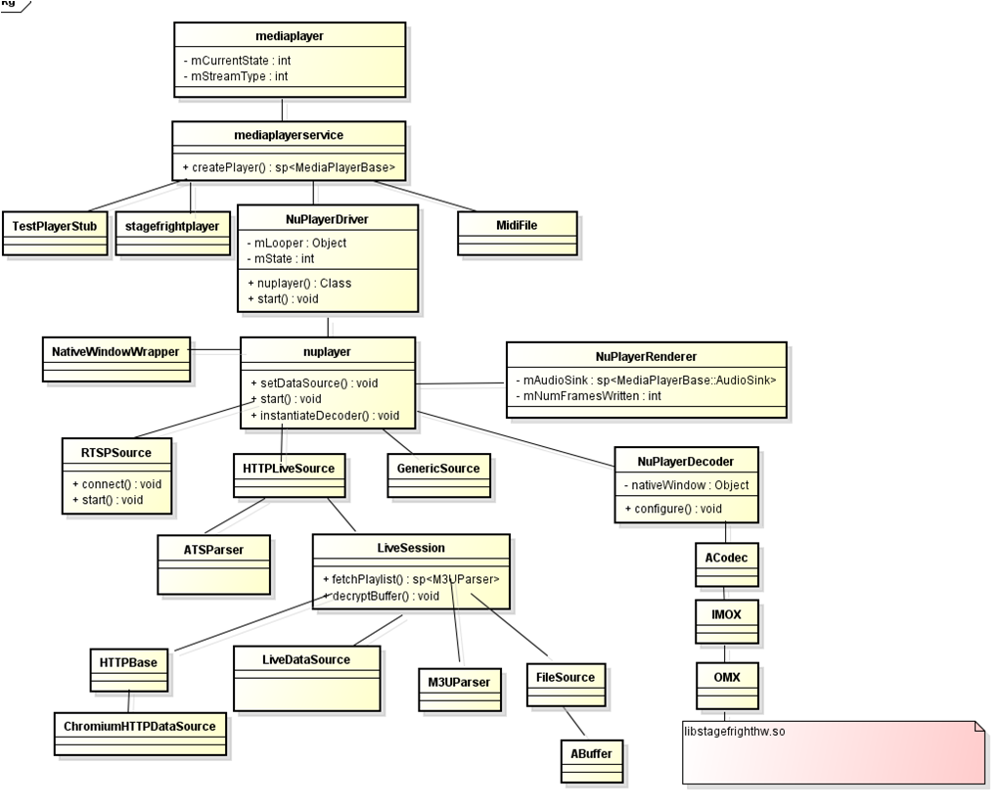
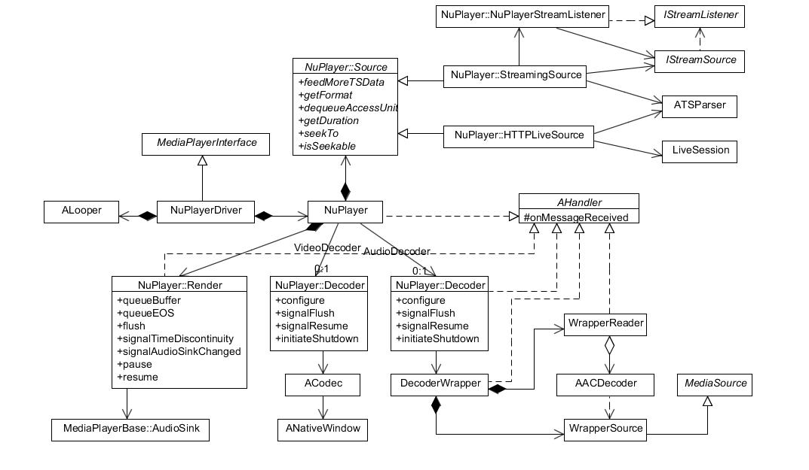
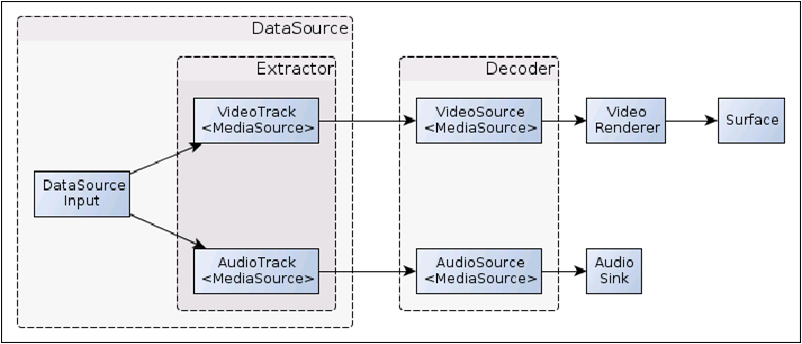

# MediaPlayer 框架开始(chap 1)


## 前言(忽略)

​	做多媒体开发都离不开MediaPlayer这个类，现在android市场已经趋于饱和，在API调用方面人人基本上已是轻车熟路。
	这里不详细赘述MediaPlayer的使用，毕竟网上例子一搜一大堆，逛网也给出了详细介绍和用法。

官网介绍：https://developer.android.com/reference/android/media/MediaPlayer.html  
官网用法：https://developer.android.com/guide/topics/media/mediaplayer.html  
	          (这里官网已经把ExoPlayer贴在导航页了，关于ExoPlayer可以点这里看Github)

一个很简单的demo如下：
```Java
MediaPlayer mediaPlayer = new MediaPlayer();  
mediaPlayer.setDataSource(path);  
mediaPlayer.setDisplay(surfaceView.getHolder());  
mediaPlayer.prepare();  
mediaPlayer.start();
```


## mediaserver 启动

我们知道，Android系统是基于Linux内核的，而在Linux系统中，所有的进程都是init进程的子孙进程，也就是说，所有的进程都是直接或者间接地由init进程fork出来的。Zygote进程也不例外，它是在系统启动的过程，由init进程创建的。


在系统启动脚本system/core/rootdir/init.rc文件中，我们可以看到启动mediaserver进程的脚本命令：

```shell
service media /system/bin/mediaserver
    class main
    user media
    group audio camera inet net_bt net_bt_admin net_bw_acct drmrpc mediadrm
    ioprio rt 4
```

**mediaserver ** 启动后会把media相关一些服务添加到 servicemanager 中，其中就有**MediaPlayerService**。这样应用启动前，系统就有了MediaPlayerService这个服务程序。位于frameworks/av/media/mediaserver/main_mediaserver.cpp的main函数中：

```c++
using namespace android;

int main(int argc __unused, char **argv __unused)
{
    signal(SIGPIPE, SIG_IGN);

    sp<ProcessState> proc(ProcessState::self());
    sp<IServiceManager> sm(defaultServiceManager());
    ALOGI("ServiceManager: %p", sm.get());
    InitializeIcuOrDie();
    MediaPlayerService::instantiate();
    ResourceManagerService::instantiate();
    registerExtensions();
    ProcessState::self()->startThreadPool();
    IPCThreadState::self()->joinThreadPool();
}
```
然后我们看看MediaPlayerService的初始化，位于frameworks/av/media/libmediaplayerservice/MediaPlayerService.cpp中:

```C++
void MediaPlayerService::instantiate() {
    defaultServiceManager()->addService(
            String16("media.player"), new MediaPlayerService());
}
```
MediaPlayerService 初始化函数，向ServiceManager注册了一个实名Binder(media.player)，可以dumpsys -l查看启动了哪些实名service。


## MediaPlayer 创建

接着我们进入应用层，看看MediaPlayer创建时做了那些事情，代码文件位置：

`frameworks\base\media\java\android\media\MediaPlayer.java`


### MediaPlayer构造

应用层MediaPlayer mediaPlayer = new MediaPlayer()。
```Java
public MediaPlayer() {
        super(new AudioAttributes.Builder().build(),
                AudioPlaybackConfiguration.PLAYER_TYPE_JAM_MEDIAPLAYER);

        Looper looper;
        if ((looper = Looper.myLooper()) != null) {
            mEventHandler = new EventHandler(this, looper);
        } else if ((looper = Looper.getMainLooper()) != null) {
            mEventHandler = new EventHandler(this, looper);
        } else {
            mEventHandler = null;
        }

        mTimeProvider = new TimeProvider(this);
        mOpenSubtitleSources = new Vector<InputStream>();

        /* Native setup requires a weak reference to our object.
         * It's easier to create it here than in C++.
         */
        native_setup(new WeakReference<MediaPlayer>(this));

        baseRegisterPlayer();
 }
```
​	构造之前MediaPlayer类有一段静态代码块，加载了media_jni.so库，用于初始jni相关，早于构造方法，在加载类时就执行。一般是全局性的数据，变量，可以放在这。

```Java
static {
        System.loadLibrary("media_jni");
        native_init();
}
```

 这里会先加载libmedia_jni的so库，需要在这里做个标记，下一节会介绍。

调用本地方法 native_init，我们找到它的jni实现，位于`frameworks/base/media/jni/android_media_MediaPlayer.cpp` 中：

```Java
// This function gets some field IDs, which in turn causes class initialization.
// It is called from a static block in MediaPlayer, which won't run until the
// first time an instance of this class is used.
static void
android_media_MediaPlayer_native_init(JNIEnv *env)
{
    jclass clazz;

    clazz = env->FindClass("android/media/MediaPlayer");
    if (clazz == NULL) {
        return;
    }

    fields.context = env->GetFieldID(clazz, "mNativeContext", "J");
    if (fields.context == NULL) {
        return;
    }

    fields.post_event = env->GetStaticMethodID(clazz, "postEventFromNative",
                                               "(Ljava/lang/Object;IIILjava/lang/Object;)V");
    if (fields.post_event == NULL) {
        return;
    }

    fields.surface_texture = env->GetFieldID(clazz, "mNativeSurfaceTexture", "J");
    if (fields.surface_texture == NULL) {
        return;
    }

    env->DeleteLocalRef(clazz);

    clazz = env->FindClass("android/net/ProxyInfo");
    if (clazz == NULL) {
        return;
    }

    fields.proxyConfigGetHost =
        env->GetMethodID(clazz, "getHost", "()Ljava/lang/String;");

    fields.proxyConfigGetPort =
        env->GetMethodID(clazz, "getPort", "()I");

    fields.proxyConfigGetExclusionList =
        env->GetMethodID(clazz, "getExclusionListAsString", "()Ljava/lang/String;");

    env->DeleteLocalRef(clazz);

    gBufferingParamsFields.init(env);

    // Modular DRM
    FIND_CLASS(clazz, "android/media/MediaDrm$MediaDrmStateException");
    if (clazz) {
        GET_METHOD_ID(gStateExceptionFields.init, clazz, "<init>", "(ILjava/lang/String;)V");
        gStateExceptionFields.classId = static_cast<jclass>(env->NewGlobalRef(clazz));

        env->DeleteLocalRef(clazz);
    } else {
        ALOGE("JNI android_media_MediaPlayer_native_init couldn't "
              "get clazz android/media/MediaDrm$MediaDrmStateException");
    }

    gPlaybackParamsFields.init(env);
    gSyncParamsFields.init(env);
    gVolumeShaperFields.init(env);
}
```
​	上述代码中涉及到的 fields:

```C++
struct fields_t {
    jfieldID    context;
    jfieldID    surface_texture;

    jmethodID   post_event;

    jmethodID   proxyConfigGetHost;
    jmethodID   proxyConfigGetPort;
    jmethodID   proxyConfigGetExclusionList;
};
static fields_t fields;
```

​	这里我们可以看到jni层设置了java层的postEventFromNative方法，从字面意思可以看出就是被native层调用，通过这样反向调用，仅被使用EventHandler post事件回到主线程中。post开头都是post到主线程，用软引用指向java层的MediaPlayer，以便native代码是线程安全的。postEventFromNative实现如下，不难理解：

```Java
private static void postEventFromNative(Object mediaplayer_ref,
                                          int what, int arg1, int arg2, Object obj)
  {
   //这就是传入到native层java层MediaPlayer弱引用
      MediaPlayer mp = (MediaPlayer)((WeakReference)mediaplayer_ref).get();
      if (mp == null) {
          return;
      }

	  ......

      //用EventHandler发送native的消息
      if (mp.mEventHandler != null) {
          Message m = mp.mEventHandler.obtainMessage(what, arg1, arg2, obj);
          mp.mEventHandler.sendMessage(m);
      }
  }
```

这里native_init的准备工作就做完了，然后就是jni层的native_setup方法的执行了。对应本地方法依然位于 `frameworks/base/media/jni/android_media_MediaPlayer.cpp`  

```Java
static void
android_media_MediaPlayer_native_setup(JNIEnv *env, jobject thiz, jobject weak_this)
{
    ALOGV("native_setup");
    sp<MediaPlayer> mp = new MediaPlayer();
    if (mp == NULL) {
        jniThrowException(env, "java/lang/RuntimeException", "Out of memory");
        return;
    }

    // create new listener and give it to MediaPlayer
    sp<JNIMediaPlayerListener> listener = new JNIMediaPlayerListener(env, thiz, weak_this);
    mp->setListener(listener);

    // Stow our new C++ MediaPlayer in an opaque field in the Java object.
    setMediaPlayer(env, thiz, mp);
}
```
​	这里创建了一个C++层的MediaPlayer，还有一些Listener回调。这个模式和Android的Looper差不多，也是java层一个Looper，C++层也有一个Looper。

​	MediaPlayer(C++)只是一个 BnMediaPlayerClient 的代理，可以理解为 JNI 层接口不变层，后面的实现可以更换。从谷歌不同的版本，播放器实现已经换了好几个。


## setDataSource过程
​	构造完 MediaPlayer 之后，就要设置数据源了。 setDataSource 有许多重载方法，我们这里就挑一个文件类型处理的方法，也方便分析。文件类型数据源上层java代码会调用本地方法，代码位于`frameworks/base/media/jni/android_media_MediaPlayer.cpp` 中。不过这次根据名字找不到对应方法了，因为它用如下一个结构体数组做了明值映射：（这个也是jni层常用的技巧，如果看过Log系统源码的应该都了解，毕竟学习jni都是从Log系统开始的）。

```C++
static JNINativeMethod gMethods[] = {
    {
        "nativeSetDataSource",
        "(Landroid/os/IBinder;Ljava/lang/String;[Ljava/lang/String;"
        "[Ljava/lang/String;)V",
        (void *)android_media_MediaPlayer_setDataSourceAndHeaders
    },

    {"_setDataSource",  "(Ljava/io/FileDescriptor;JJ)V", (void *)android_media_MediaPlayer_setDataSourceFD},
	//省略许多方法映射
	......
};
```

​	这个结构体数组几乎映射了所有MediaPlayer方法处理，我们这里只关心setDataSource，所以照上面找到文件中的android_media_MediaPlayer_setDataSourceFD方法:

```C++
static void
android_media_MediaPlayer_setDataSourceFD(JNIEnv *env, jobject thiz, jobject fileDescriptor, jlong offset, jlong length)
{
    sp<MediaPlayer> mp = getMediaPlayer(env, thiz);
    if (mp == NULL ) {
        jniThrowException(env, "java/lang/IllegalStateException", NULL);
        return;
    }

    if (fileDescriptor == NULL) {
        jniThrowException(env, "java/lang/IllegalArgumentException", NULL);
        return;
    }
    int fd = jniGetFDFromFileDescriptor(env, fileDescriptor);
    ALOGV("setDataSourceFD: fd %d", fd);
    // 重点在于 mp->setDataSource(fd, offset, length)
    process_media_player_call( env, thiz, mp->setDataSource(fd, offset, length), "java/io/IOException", "setDataSourceFD failed." );
}
```

​	这一步先获取C++层的MediaPlayer，然后获取数据源文件描述符，最后调用 process_media_player_call 检查返回状态，在参数里已经让C++层的MediaPlayer调用了 setDataSource 方法。我们先看看process_media_player_call 的实现：

```C++
// If exception is NULL and opStatus is not OK, this method sends an error
// event to the client application; otherwise, if exception is not NULL and
// opStatus is not OK, this method throws the given exception to the client
// application.
static void process_media_player_call(JNIEnv *env, jobject thiz, status_t opStatus, const char* exception, const char *message)
{
    if (exception == NULL) {  // Don't throw exception. Instead, send an event.
        if (opStatus != (status_t) OK) {
            sp<MediaPlayer> mp = getMediaPlayer(env, thiz);
            if (mp != 0) mp->notify(MEDIA_ERROR, opStatus, 0);
        }
    } else {  // Throw exception!
        if ( opStatus == (status_t) INVALID_OPERATION ) {
            jniThrowException(env, "java/lang/IllegalStateException", NULL);
        } else if ( opStatus == (status_t) BAD_VALUE ) {
            jniThrowException(env, "java/lang/IllegalArgumentException", NULL);
        } else if ( opStatus == (status_t) PERMISSION_DENIED ) {
            jniThrowException(env, "java/lang/SecurityException", NULL);
        } else if ( opStatus != (status_t) OK ) {
            if (strlen(message) > 230) {
               // if the message is too long, don't bother displaying the status code
               jniThrowException( env, exception, message);
            } else {
               char msg[256];
                // append the status code to the message
               sprintf(msg, "%s: status=0x%X", message, opStatus);
               jniThrowException( env, exception, msg);
            }
        }
    }
}
```

​	看代码和注释能看出process_media_player_call主要是做错误和异常检测工作，然后notify出去相应错误状态。

​	接着就是调用C++层MediaPlayer的setData方法，这个我们下一节详细分析，本节我们知道setDataSource最后调用了C++层MediaPlayer的setData方法。 


## setDisplay过程

下一步就是 java 层的 setDisplay, 依然查看java层代码 MediaPlayer:

```Java
 /**
     * Sets the {@link SurfaceHolder} to use for displaying the video
     * portion of the media.
     *
     * Either a surface holder or surface must be set if a display or video sink
     * is needed.  Not calling this method or {@link #setSurface(Surface)}
     * when playing back a video will result in only the audio track being played.
     * A null surface holder or surface will result in only the audio track being
     * played.
     *
     * @param sh the SurfaceHolder to use for video display
     * @throws IllegalStateException if the internal player engine has not been
     * initialized or has been released.
     */
    public void setDisplay(SurfaceHolder sh) {
        mSurfaceHolder = sh;
        Surface surface;
        if (sh != null) {
            surface = sh.getSurface();
        } else {
            surface = null;
        }
        _setVideoSurface(surface);
        updateSurfaceScreenOn();
    }
    
    /*
     * Update the MediaPlayer SurfaceTexture.
     * Call after setting a new display surface.
     */
    private native void _setVideoSurface(Surface surface);    
```

​	会调用本地方法_setVideoSurface，我们继续找到它的jni实现，代码位置`frameworks/base/media/jni/android_media_MediaPlayer.cpp` :

```C++
static void
android_media_MediaPlayer_setVideoSurface(JNIEnv *env, jobject thiz, jobject jsurface)
{
    setVideoSurface(env, thiz, jsurface, true /* mediaPlayerMustBeAlive */);
}


static void
setVideoSurface(JNIEnv *env, jobject thiz, jobject jsurface, jboolean mediaPlayerMustBeAlive)
{
    sp<MediaPlayer> mp = getMediaPlayer(env, thiz);
    if (mp == NULL) {
        if (mediaPlayerMustBeAlive) {
            jniThrowException(env, "java/lang/IllegalStateException", NULL);
        }
        return;
    }

    // 将旧的 IGraphicBufferProducer 的强引用减 1
    decVideoSurfaceRef(env, thiz);

    // IGraphicBufferProducer 图层缓冲区合成器
    sp<IGraphicBufferProducer> new_st;
    if (jsurface) {
        //获得 java 层 surface
        sp<Surface> surface(android_view_Surface_getSurface(env, jsurface));
        if (surface != NULL) {
            new_st = surface->getIGraphicBufferProducer();
            if (new_st == NULL) {
                jniThrowException(env, "java/lang/IllegalArgumentException",
                    "The surface does not have a binding SurfaceTexture!");
                return;
            }
            
            // IGraphicBufferProducer 的强引用 +1
            new_st->incStrong((void*)decVideoSurfaceRef);
        } else {
            jniThrowException(env, "java/lang/IllegalArgumentException",
                    "The surface has been released");
            return;
        }
    }

    // 在native_init方法中将 java 层 mNativeSurfaceTexture 查找给了jni 层 
    //		fields.surface_texture
    // 这里将 IGraphicBufferProducer 赋给它
    // ??可以理解 fields.surface_texture 是全局保存，而当冲行 new 一个 MediaoPlayer
    //   可以再次调用 setDisplayer, 那么上一个设置的内容将如何显示？？
    env->SetLongField(thiz, fields.surface_texture, (jlong)new_st.get());

    // This will fail if the media player has not been initialized yet. This
    // can be the case if setDisplay() on MediaPlayer.java has been called
    // before setDataSource(). The redundant call to setVideoSurfaceTexture()
    // in prepare/prepareAsync covers for this case.
    
    // 如果 MediaPlayer 没有初始化,这一步会失败,原因可能是 setDisplay 在 setDataSource之前
    // 如果在 prepare/prepareAsync 时想规避这个错误而去调用setVideoSurfaceTexture是多余的。
    // 最终会调用C++层的setVideoSurfaceTexture方法，下一节在分析
    mp->setVideoSurfaceTexture(new_st);
}
```
​	这一步主要是对图像显示的surface的保存，然后将旧的IGraphicBufferProducer强引用减一，再获得新的IGraphicBufferProducer，最后会调用C++的MediaPlayer的setVideoSurfaceTexture将它折纸进去。

​	IGraphicBufferProducer是SurfaceFlinger的内容，一个UI完全显示到diplay的过程，SurfaceFlinger扮演着重要的角色但是它的职责是“Flinger”，即把系统中所有应用程序的最终的“绘图结果”进行“混合”，然后统一显示到物理屏幕上，而其他方面比如各个程序的绘画过程，就由其他东西来担任了。这个光荣的任务自然而然地落在了BufferQueue的肩膀上，它是每个应用程序“一对一”的辅导老师，指导着UI程序的“画板申请”、“作画流程”等一系列细节。下面的图描述了这三者的关系：



​	虽说是三者的关系，但是他们所属的层却只有两个，app属于Java层，BufferQueue/SurfaceFlinger属于native层。也就是说BufferQueue也是隶属SurfaceFlinger，所有工作围绕SurfaceFlinger展开。

​	这里IGraphicBufferProducer就是app和BufferQueue重要桥梁，GraphicBufferProducer承担着单个应用进程中的UI显示需求，与BufferQueue打交道的就是它。后面的prepare和start直接和C++层MediaPlayer相关，因此我们再下一节分析，这里就简单到此。


#MediaPlayer C/S架构及C++调用步骤 (chap2) 

​	上一节主要分析了MediaPlayer从java层到jni层做的一些工作，并且setDataSource和后续流程还没有往下分析。这一节先介绍MediaPlayer的C/S架构，然后顺着架构往下深究，我们的思路会更清晰。

## MediaPlayer的C/S架构

​	整个MediaPlayer在运行的时候，可以分成Client和Server两个部分，它们分别在两个进程中运行，它们之间使用Binder机制实现IPC通信。架构图如下:



​	1）如果从功能从上往下看，最上层是java层MediaPlayer的API，然后是jni层到C++层之间的IPC通信，最下边就是player的具体实现了（如StageFrightPlayer、MstarPlayer）。

​	2）C++层是比较重要的环节，这一块也是C/S架构的核心。主要围绕C++层MediaPlayer通过BpMediaPlayerService这个本地proxy对象，经过IPC与远程服务MediaPlayerService(BnMediaPlayerService)通信，完成C/S架构。（其实Android有很多模块设计都是C/S架构，都是通过BpXXX这个代理皮包和拥有干货的BnXXX通信。这里的p指的是proxy，n就是native）

​	3）当Server端收到Client端的请求，MediaPlayerService会为每一个Client进程创建一个会话，这里就是new一个MediaPlayerService:Client对象和其交互。然后这个对象再根据Client端请求的资源类型去判断创建什么类型的Player，就是最下边那些。（其实这些Player有些是芯片商自己做的，每家做的都不一样）


## C++层MediaPlayer实现
​	上一节我们只是分析了从java层到jni层的一些步骤，应该算是准备工作，正好我们入门。这次我们从jni层入手，应该位于架构图中客户端进程部分，C++层MediaPlayer往上，jni层往下的部分。继续往下，还得从setDataSource入手。


### setDataSource C++实现

​	通过JNI方式调用到 framework 层   `frameworks/base/media/jni/android_media_MediaPlayer.cpp `，继而调用 `frameworks/av/media/libmedia/mediaplayer.cpp`。我们找到 setDataSource 方法，上次我们分析的而是获取文件描述符的重载方法：

```C++
status_t MediaPlayer::setDataSource(int fd, int64_t offset, int64_t length)
{
    ALOGV("setDataSource(%d, %" PRId64 ", %" PRId64 ")", fd, offset, length);
    status_t err = UNKNOWN_ERROR;
    const sp<IMediaPlayerService> service(getMediaPlayerService());
    if (service != 0) {
        sp<IMediaPlayer> player(service->create(this, mAudioSessionId));
        if ((NO_ERROR != doSetRetransmitEndpoint(player)) ||
            (NO_ERROR != player->setDataSource(fd, offset, length))) {
            player.clear();
        }
        err = attachNewPlayer(player);
    }
    return err;
}
```

​	在整个应用程序的进程中，Mediaplayer.cpp 中 setDataSource会从ServiceManager中获得**MediaPlayerService**  服务( 通过注册的 media.player )，然后通过服务来创建**player**,这个**player**就是播放器的真实实例。

可以简单理解为通过应用 java 层代码：

```Java
MediaPlayer mediaPlayer = new MediaPlayer();
mediaPlayer.setDataSouce(...);
```

整个过程应用 app 进程并不创建播放器，只是通过远程调用在 media.player 进程中创建一个 MediaPlayer。


分工步骤如下：

#### 通过Binder获取远程服务
​	通过 getMediaPlayerService 得到的service其实是 BpMediaPlayerService，这是和MediaPlayerService进程中的BnMediaPlayerService 相对应负责binder通讯。BpMediaPlayerService中的create其实通过binder机制将CREATE消息发送出去。位于`framework/av/media/libmedia/IMediaPlayerService.cpp`

```C++
virtual sp<IMediaPlayer> create(
            const sp<IMediaPlayerClient>& client, audio_session_t audioSessionId) {
        Parcel data, reply;
        data.writeInterfaceToken(IMediaPlayerService::getInterfaceDescriptor());
        data.writeStrongBinder(IInterface::asBinder(client));
        data.writeInt32(audioSessionId);

        remote()->transact(CREATE, data, &reply);
        return interface_cast<IMediaPlayer>(reply.readStrongBinder());
    }
```

​	在对面的BnMediaPlayerService中，通过onTransact()接受这些消息，并把结果返回。同样位于`framework/av/media/libmedia/IMediaPlayerService.cpp`：

```C++
status_t BnMediaPlayerService::onTransact(
    uint32_t code, const Parcel& data, Parcel* reply, uint32_t flags)
{
    switch (code) {
        case CREATE: {
            CHECK_INTERFACE(IMediaPlayerService, data, reply);
            sp<IMediaPlayerClient> client =
                interface_cast<IMediaPlayerClient>(data.readStrongBinder());
            audio_session_t audioSessionId = (audio_session_t) data.readInt32();
            sp<IMediaPlayer> player = create(client, audioSessionId);
            reply->writeStrongBinder(IInterface::asBinder(player));
            return NO_ERROR;
        } break;
        case CREATE_MEDIA_RECORDER: {
            .....
        }
    }
}
```


#### 服务端创建会话

​	当发现是CREATE才真正调用了MediaPlayerService 中的create函数，位于`framework/av/media/libmediaplayerservice/MediaPlayerService.cpp` 中：

```C++
class MediaPlayerService : public BnMediaPlayerService
```


```C++
sp<IMediaPlayer> MediaPlayerService::create(const sp<IMediaPlayerClient>& client,
        audio_session_t audioSessionId)
{
    pid_t pid = IPCThreadState::self()->getCallingPid();
    int32_t connId = android_atomic_inc(&mNextConnId);

    sp<Client> c = new Client(
            this, pid, connId, client, audioSessionId,
            IPCThreadState::self()->getCallingUid());

    ALOGV("Create new client(%d) from pid %d, uid %d, ", connId, pid,
         IPCThreadState::self()->getCallingUid());

    wp<Client> w = c;
    {
        Mutex::Autolock lock(mLock);
        mClients.add(w);
    }
    return c;
}
```

​	在create函数中其实是创建了一个MediaPlayerService::Client的实例，也就是 说MediaPlayerService会为每个client应用进程创建一个相应的MediaPlayerService::Client的实例，来提供服务。

 	这样 Mediaplayer.cpp 就得到了一个player的实例，对他来说这个实例和本地的其他类的实例没什么用法上的区别，殊不知其实这个实例是运行在另外一个进程中。实现这种假象的就是binder机制。


 #### 回执后setDataSource流程

回顾一下我们文件  `frameworks/av/media/libmedia/mediaplayer.cpp` 中的 setDataSource 函数

```C++
status_t MediaPlayer::setDataSource(int fd, int64_t offset, int64_t length)
{
    ALOGV("setDataSource(%d, %" PRId64 ", %" PRId64 ")", fd, offset, length);
    status_t err = UNKNOWN_ERROR; 
    const sp<IMediaPlayerService> service(getMediaPlayerService());
    if (service != 0) {
        // 这里实际上是 MediaPlayerService::Client 实例
        sp<IMediaPlayer> player(service->create(this, mAudioSessionId));
        if ((NO_ERROR != doSetRetransmitEndpoint(player)) ||
            (NO_ERROR != player->setDataSource(fd, offset, length))) {
            player.clear();
        }
        err = attachNewPlayer(player);
    }
    return err;
}
```

service->create(this, mAudioSessionId) 返回的是一个  MediaPlayerService::Client 实例，然后调用的

```
player->setDataSource(fd, offset, length)
```

其实就是调用 `MediaPlayerService::Client` 下的 setDataSource 方法，我们继续查看MediaPlayerService::Client::setDataSource 方法：

```C++
status_t MediaPlayerService::Client::setDataSource(int fd, int64_t offset, int64_t length)
{
    ALOGV("setDataSource fd=%d (%s), offset=%lld, length=%lld",
            fd, nameForFd(fd).c_str(), (long long) offset, (long long) length);
    struct stat sb;
    int ret = fstat(fd, &sb);
    if (ret != 0) {
        ALOGE("fstat(%d) failed: %d, %s", fd, ret, strerror(errno));
        return UNKNOWN_ERROR;
    }

    ALOGV("st_dev  = %llu", static_cast<unsigned long long>(sb.st_dev));
    ALOGV("st_mode = %u", sb.st_mode);
    ALOGV("st_uid  = %lu", static_cast<unsigned long>(sb.st_uid));
    ALOGV("st_gid  = %lu", static_cast<unsigned long>(sb.st_gid));
    ALOGV("st_size = %llu", static_cast<unsigned long long>(sb.st_size));

    if (offset >= sb.st_size) {
        ALOGE("offset error");
        return UNKNOWN_ERROR;
    }
    if (offset + length > sb.st_size) {
        length = sb.st_size - offset;
        ALOGV("calculated length = %lld", (long long)length);
    }

    player_type playerType = MediaPlayerFactory::getPlayerType(this,
                                                               fd,
                                                               offset,
                                                               length);
    sp<MediaPlayerBase> p = setDataSource_pre(playerType);
    if (p == NULL) {
        return NO_INIT;
    }

    // now set data source
    setDataSource_post(p, p->setDataSource(fd, offset, length));
    return mStatus;
}
```

​	这也也要分步骤执行，我们一步一步去看，然后才能弄清楚每一步的职责。

1）先是获取播放器的类型，我们进入MediaPlayerFactory类看看getPlayerType方法，位于`framework/av/media/libmediaplayerservice/MediaPlayerFactory.cpp` 中：

```C++
player_type MediaPlayerFactory::getPlayerType(const sp<IMediaPlayer>& client,
                                              const char* url) {
    GET_PLAYER_TYPE_IMPL(client, url);
}

// 宏定义内容如下
#define GET_PLAYER_TYPE_IMPL(a...)                      \
    Mutex::Autolock lock_(&sLock);                      \
                                                        \
    player_type ret = STAGEFRIGHT_PLAYER;               \
    float bestScore = 0.0;                              \
                                                        \
    for (size_t i = 0; i < sFactoryMap.size(); ++i) {   \
                                                        \
        IFactory* v = sFactoryMap.valueAt(i);           \
        float thisScore;                                \
        CHECK(v != NULL);                               \
        thisScore = v->scoreFactory(a, bestScore);      \
        if (thisScore > bestScore) {                    \
            ret = sFactoryMap.keyAt(i);                 \
            bestScore = thisScore;                      \
        }                                               \
    }                                                   \
                                                        \
    if (0.0 == bestScore) {                             \
        ret = getDefaultPlayerType();                   \
    }                                                   \
                                                        \
    return ret;

//简单的展开为:
player_type MediaPlayerFactory::getPlayerType(const sp<IMediaPlayer>& client,
                                              const char* url) {
    Mutex::Autolock lock_(&sLock);                                                         
    player_type ret = STAGEFRIGHT_PLAYER; 
    float bestScore = 0.0;                                                         
    for (size_t i = 0; i < sFactoryMap.size(); ++i) {             
        IFactory* v = sFactoryMap.valueAt(i);           
        float thisScore;                                
        CHECK(v != NULL);                               
        thisScore = v->scoreFactory(client, url, bestScore);      
        if (thisScore > bestScore) {                    
            ret = sFactoryMap.keyAt(i);                 
            bestScore = thisScore;                      
        }                                               
    }                                                   
                                                        
    if (0.0 == bestScore) {                             
        ret = getDefaultPlayerType();                   
    }                                                   
                                                        
    return ret;
}
```

​	这里定义一个宏来选择播放器类型，里面的for循环也很简单，就是查询注册进来的播放器map中的score得分，谁的得分最高，就返回这个播放器。默认返回的是 StageFright（舞台恐惧者，Google总喜欢用一些稀奇古怪的名字命名它的模块组件）。

​	我看可以查看 MediaPlayerFactory.cpp 这个文件，这个文件里面有许多种类型的播放器工厂，可以创建出不同的播放器，如 StagefrightPlayer、NuPlayerDriver、MidiFile 等等。如果厂商要定制自己的播放器，就可以在这里做文章。比如Mstar或者海思自己的播放器，MstarPlayer、HisiPlayer。创建自己的工厂类，实现createPlayer方法，然后修改scoreFactory返回得分值为一个较大的数值，再注册进sFactoryMap变量。或者直接修改GET_PLAYER_TYPE_IMPL宏和getDefaultPlayerType方法的规则。

 	这里我们就选取默认值 STAGEFRIGHT_PLAYER，位于( android P ) `frameworks/av/include/media/MediaPlayerInterface.h` 

```C++
enum player_type {
    STAGEFRIGHT_PLAYER = 3,
    NU_PLAYER = 4,
    // Test players are available only in the 'test' and 'eng' builds.
    // The shared library with the test player is passed passed as an
    // argument to the 'test:' url in the setDataSource call.
    TEST_PLAYER = 5,
};
```


2）根据上述选取的 STAGEFRIGHT_PLAYER 创建播放器。回到上面继续查看 setDataSource_pre 方法:

```C++
sp<MediaPlayerBase> MediaPlayerService::Client::setDataSource_pre(
        player_type playerType)
{
    ALOGV("player type = %d", playerType);
    clearDeathNotifiers();

    // create the right type of player
    sp<MediaPlayerBase> p = createPlayer(playerType);
    if (p == NULL) {
        return p;
    }

    sp<IServiceManager> sm = defaultServiceManager();
    sp<IBinder> binder = sm->getService(String16("media.extractor"));
    if (binder == NULL) {
        ALOGE("extractor service not available");
        return NULL;
    }
    mExtractorDeathListener = new ServiceDeathNotifier(binder, p, MEDIAEXTRACTOR_PROCESS_DEATH);
    binder->linkToDeath(mExtractorDeathListener);

    ......
    // 设置音频输出
    if (!p->hardwareOutput()) {
        Mutex::Autolock l(mLock);
        mAudioOutput = new AudioOutput(mAudioSessionId, IPCThreadState::self()->getCallingUid(),
                mPid, mAudioAttributes);
        static_cast<MediaPlayerInterface*>(p.get())->setAudioSink(mAudioOutput);
    }

    return p;
}


sp<MediaPlayerBase> MediaPlayerService::Client::createPlayer(player_type playerType)
{
    // determine if we have the right player type
    // 确定正确的播放器类型, 如果不正确删除旧播放器
    sp<MediaPlayerBase> p = getPlayer();
    if ((p != NULL) && (p->playerType() != playerType)) {
        ALOGV("delete player");
        p.clear();
    }
    if (p == NULL) {
        p = MediaPlayerFactory::createPlayer(playerType, this, notify, mPid);
    }

    if (p != NULL) {
        p->setUID(mUid);
    }

    return p;
}


```

最后会调用MediaPlayerFactory::createPlayer静态方法，我们进去看看怎么实现：

文件位置 `fameworks/av/media/libmediaplayerservice/MediaPlayerFactory.cpp`

```C++
sp<MediaPlayerBase> MediaPlayerFactory::createPlayer(
        player_type playerType,
        void* cookie,
        notify_callback_f notifyFunc,
        pid_t pid) {
    sp<MediaPlayerBase> p;
    IFactory* factory;
    status_t init_result;
    Mutex::Autolock lock_(&sLock);

    // 根据 playerType 找到对应的播放器实现
    // 还记得默认的类型 STAGEFRIGHT_PLAYER 吗？
    
    if (sFactoryMap.indexOfKey(playerType) < 0) {
        ALOGE("Failed to create player object of type %d, no registered"
              " factory", playerType);
        return p;
    }

    factory = sFactoryMap.valueFor(playerType);
    CHECK(NULL != factory);
    p = factory->createPlayer(pid);

    if (p == NULL) {
        ALOGE("Failed to create player object of type %d, create failed",
               playerType);
        return p;
    }

    init_result = p->initCheck();
    if (init_result == NO_ERROR) {
        p->setNotifyCallback(cookie, notifyFunc);
    } else {
        ALOGE("Failed to create player object of type %d, initCheck failed"
              " (res = %d)", playerType, init_result);
        p.clear();
    }

    return p;
}
```

~~在 Android P 中对于 StagefrightPlayerFactory 的代码已经取消了，而实际上是被 NU_PLAYER 取代。~~ 至少在 Android P 中   `frameworks/av/media/libmediaplayerservice/MediaPlayerFactory.cpp ` 中是没有 `class StagefrightPlayerFactory`  ，取而代之的是 `class NuPlayerFactory`  

```C++
class NuPlayerFactory : public MediaPlayerFactory::IFactory {
  public:
   	// ......
    virtual sp<MediaPlayerBase> createPlayer(pid_t pid) {
        ALOGV(" create NuPlayer");
        return new NuPlayerDriver(pid);
    }
};
```

总结一下：

`MediaPlayerService::Client::createPlayer` ,

`MediaPlayerService::Client::setDataSource_pre` ,

`MediaPlayerService::Client::setDataSource` 

中的 `sp<MediaPlayerBase> p` 最后真正的实例是 *NuPlayerDriver*  。

于是接续我们 `MediaPlayerService::Client::setDataSource`，上面已经介绍了，主要是调用下面的：

```C++
// now set data source
setDataSource_post(p, p->setDataSource(fd, offset, length));
```


#### NuPlayerDriver setDataSource 真正的执行接受者

代码文件 `frameworks/av/media/libmediaplayerservice/nuplayer/NuPlayerDriver.cpp`

```C++
status_t NuPlayerDriver::setDataSource(int fd, int64_t offset, int64_t length) {
    ALOGV("setDataSource(%p) file(%d)", this, fd);
    Mutex::Autolock autoLock(mLock);

    if (mState != STATE_IDLE) {
        return INVALID_OPERATION;
    }

    mState = STATE_SET_DATASOURCE_PENDING;

    mPlayer->setDataSourceAsync(fd, offset, length);

    while (mState == STATE_SET_DATASOURCE_PENDING) {
        mCondition.wait(mLock);
    }

    return mAsyncResult;
}
```

这里并没有结束我们的 setDataSouce 而来了个 `mPlayer->setDataSourceAsync(fd, offset, length)`   真正的最终的代码执行者为 *NuPlayer* 。

代码文件位置 `frameworks/av/media/libmediaplayerservice/nuplayer/NuPlayer.cpp`

```C++
void NuPlayer::setDataSourceAsync(int fd, int64_t offset, int64_t length) {
    sp<AMessage> msg = new AMessage(kWhatSetDataSource, this);

    sp<AMessage> notify = new AMessage(kWhatSourceNotify, this);

    sp<GenericSource> source =
            new GenericSource(notify, mUIDValid, mUID);

    ALOGV("setDataSourceAsync fd %d/%lld/%lld source: %p",
            fd, (long long)offset, (long long)length, source.get());

    status_t err = source->setDataSource(fd, offset, length);

    if (err != OK) {
        ALOGE("Failed to set data source!");
        source = NULL;
    }

    msg->setObject("source", source);
    msg->post();
    mDataSourceType = DATA_SOURCE_TYPE_GENERIC_FD;
}
```

上面的代码做了如下的几件事情:

1. 创建的两个 AMessage  实例 msg 和  notify;
2. 创建了一个 GenericSource 实例，并将 source 信息通过函数 setDataSource 设置进去;
3. 通过 msg 将消息发送出去;

简单分析一下 `NuPlayer::GenericSource::setDataSource`，文件路径 `frameworks/av/meida/libmediaplayerservice/nuplayer/GenericSource.cpp`

```C++
status_t NuPlayer::GenericSource::setDataSource(
        int fd, int64_t offset, int64_t length) {
    ALOGV("setDataSource %d/%lld/%lld", fd, (long long)offset, (long long)length);

    resetDataSource();

    mFd = dup(fd);
    mOffset = offset;
    mLength = length;

    // delay data source creation to prepareAsync() to avoid blocking
    // the calling thread in setDataSource for any significant time.
    return OK;
}
```

就是将一些基本信息保存一边后面使用，也无需多加详解;

关注一下 `NuPlayer::setDataSourceAsync` 中的 msg 发送到哪里去了？ 无需多说 ` struct NuPlayer : public AHandler`  就在他自己身上实现了：

```C++
void NuPlayer::onMessageReceived(const sp<AMessage> &msg) {
    switch (msg->what()) {
        case kWhatSetDataSource:
        {
            ALOGV("kWhatSetDataSource");

            CHECK(mSource == NULL);

            status_t err = OK;
            sp<RefBase> obj;
            CHECK(msg->findObject("source", &obj));
            if (obj != NULL) {
                Mutex::Autolock autoLock(mSourceLock);
                mSource = static_cast<Source *>(obj.get());
            } else {
                err = UNKNOWN_ERROR;
            }

            CHECK(mDriver != NULL);
            sp<NuPlayerDriver> driver = mDriver.promote();
            if (driver != NULL) {
                driver->notifySetDataSourceCompleted(err);
            }
            break;
        }
......
```

主要是数据类型转化，然后就是调用了 

```C++
void NuPlayerDriver::notifySetDataSourceCompleted(status_t err) {
    Mutex::Autolock autoLock(mLock);

    CHECK_EQ(mState, STATE_SET_DATASOURCE_PENDING);

    mAsyncResult = err;
    mState = (err == OK) ? STATE_UNPREPARED : STATE_IDLE;
    mCondition.broadcast();
    // 还记得 NuPlayerDriver::setDataSource 下的
    // while (mState == STATE_SET_DATASOURCE_PENDING) {
    //    mCondition.wait(mLock);
    //} 吗？ 这里是呼应
}
```

一旦我们成功调用了 setDataSouce 后，内部播放器就进入了 STATE_UNPREPARED 状态;

到此我们的从 MediaPlayer 初始化到完成 setDataSource 的过程已经描述完成，其他的 MediaPlayer 的阅读方式可以参照进行。


# ~~从StageFright到AwesomePlayer(chap3)~~

​	上一节我们分析到了MediaPlayer的C/S架构最下层的StagefrightPlayer，今天我们继续往下挖，看看这个东西到底是个什么鬼。(为了文章的连续性，对于Android P舍弃的 StagefrightPlayer，还是需要介绍一下，可以 [点击我](http://windrunnerlihuan.com/archives/) 查看原始文章内容。


## 皮包公司StagefrightPlayer

​	上一节我们再次止步于C++层的setDateSource，但是我们初窥了StatefrightPlayer，简要了解android高版本对opencore的舍弃，和采用了Stagefright框架。所以我们来看看这个StagefrightPlayer是怎么实现的。位于`frameworks/av/media/libmediaplayerservice/StagefrightPlayer.cpp`：

```C++
......
StagefrightPlayer::StagefrightPlayer()
    : mPlayer(new AwesomePlayer) { 
    //StagefrightPlayer构造方法默认创建了AwesomePlayer代替他完成职能
    ALOGV("StagefrightPlayer");
    mPlayer->setListener(this);
}

StagefrightPlayer::~StagefrightPlayer() {
    ALOGV("~StagefrightPlayer");
    reset();
    delete mPlayer;
    mPlayer = NULL;
}

// Warning: The filedescriptor passed into this method will only be valid until
// the method returns, if you want to keep it, dup it!
status_t StagefrightPlayer::setDataSource(int fd, int64_t offset, int64_t length) {
    ALOGV("setDataSource(%d, %lld, %lld)", fd, offset, length);
    return mPlayer->setDataSource(dup(fd), offset, length);
}


status_t StagefrightPlayer::setVideoSurfaceTexture(
        const sp<IGraphicBufferProducer> &bufferProducer) {
    ALOGV("setVideoSurfaceTexture");

    return mPlayer->setSurfaceTexture(bufferProducer);
}

status_t StagefrightPlayer::prepare() {
    return mPlayer->prepare();
}

...省略诸多AwesomePlayer代替他完成职能的方法

......
```

​	我们看到这个StagefrightPlayer其实是个皮包公司，对 MediaPlayerInterface 接口的实现方法都是由**AwesomePlayer** 这个播放器来实现的。(听着名字都应该是装饰模式关系，StageFright叫舞台恐怖者，Awesome是令人畏惧者，一个前台耍花腔散播恐惧，一个后台实际操控恐怖主义)。

​	前面一篇中，分析到mediaplayerservice会调到Stagefright中，进行编码解码操作 在libsstagefright中,预设的多媒体解码是openCore，由于其过于庞大和复杂，需要成本较高，开始引进了另一个框架，也就是stagefright框架，以后默认情况Android选择stagefright，但是并没有完全抛弃opencore，做了一个OMX层，仅仅是对 opencore的omx-component部分做了引用。stagefright是和opencore是并列的。Stagefright在  Android中是以shared library的形式存在(libstagefright.so)，其中的module –  AwesomePlayer可用来播放video/audio。  AwesomePlayer提供许多API，可以让上层的应用程序(Java/JNI)来调用。


## 播放器基本模型

​	AwesomePlayer不管有多么神秘，说到底还是个播放器。在播放器的基本模型上，他与VLC、mplayer、ffmpeg等开源的结构是一致的。只是组织实现的方式不同。

​	深入了解AwesomePlayer 之前，把播放器的基本模型总结一下，然后按照模型的各个部分来深入研究AwesomePlayer 的实现方式。



播放器大致分为 4 大部分:  source、 demux、decoder、 output

* **source数据源**：数据源，数据的来源不一定都是本地file，也有可能是网路上的各种协议例如：http、rtsp、HLS等。source的任务就是把数据源抽象出来，为下一个demux模块提供它需要的稳定的数据流。demux不用关心数据到底是从什么地方来的。

* **demux解复用**：视频文件一般情况下都是把音视频的ES流交织的通过某种规则放在一起。这种规则就是容器规则。现在有很多不同的容器格式。如ts、mp4、flv、mkv、avi、rmvb等等。demux的功能就是把音视频的ES流从容器中剥离出来，然后分别送到不同的解码器中。其实音频和视频本身就是2个独立的系统。容器把它们包在了一起。但是他们都是独立解码的，所以解码之前，需要把它分别 独立出来。demux就是干这活的，他为下一步decoder解码提供了数据流。

* **decoder解码**：解码器—-播放器的核心模块。分为音频和视频解码器。影像在录制后,  原始的音视频都是占用大量空间, 而且是冗余度较高的数据. 因此, 通常会在制作的时候就会进行某种压缩 (  压缩技术就是将数据中的冗余信息去除数据之间的相关性 ). 这就是我们熟知的音视频编码格式, 包括MPEG1（VCD）\ MPEG2（DVD）\  MPEG4 \ H.264 等等. 音视频解码器的作用就是把这些压缩了的数据还原成原始的音视频数据. 当然, 编码解码过程基本上都是有损的  .解码器的作用就是把编码后的数据还原成原始数据。

* **output输出**：输出部分分为音频和视频输出。解码后的音频（pcm）和视频（yuv）的原始数据需要得到音视频的output模块的支持才能真正的让人的感官系统（眼和耳）辨识到。

		所以，播放器大致分成上述4部分。怎么抽象的实现这4大部分、以及找到一种合理的方式将这几部分组织并运动起来。是每个播放器不同的实现方式而已。接下来就围绕这4大部分做深入学习，看看AwesomePlayer 是怎么玩的吧。


## AwesomePlayer基础

### AwesomePlayer事件调度器(TimedEventQueue-event)

​	 在分析AwesomePlayer的主要流程前，我们先了解一下它的时间调度机制，为以后分析主流程打好基础。

​	 视频处理过程中有很多都是十分耗时的，如果都放在一个大的线程空间中。用户体验的效果可想而知。所以通常都是做异步操作。

​	AwesomePlayer是通过event事件调度来实现这些功能之间的驱动和调用的，类似于上层的 Handler-Looper。AwesomePlayer中的内部变量TimedEventQueue  mQueue；位于`frameworks/av/media/libstagefright/include/AwesomePlayer.h` 中：

```C++
TimedEventQueue mQueue;
```

​	这个mQueue就是AwesomePlayer的事件队列，也是事件调度器。从他类型的名字上就能很清楚的看出他是以时间为基础事件队列。接下来看看它是怎么玩转的。




# NuPlayer(chap4)

​	Android2.3时引入流媒体框架，而流媒体框架的核心是NuPlayer。在之前的版本中一般认为 Local  Playback就用 Stagefrightplayer+Awesomeplayer，流媒体用 NuPlayer。Android4.0之后HttpLive和RTSP协议开始使用NuPlayer播放器，Android5.0（L版本）之后本地播放也开始使用NuPlayer播放器。 Android7.0(N版本)则完全去掉了Awesomeplayer。  通俗点说，NuPlayer是AOSP中提供的多媒体播放框架，能够支持本地文件、HTTP（HLS）、RTSP等协议的播放，通常支持H.264、H.265/HEVC、AAC编码格式，支持MP4、MPEG-TS封装。  在实现上NuPlayer和Awesomeplayer不同，NuPlayer基于StagefrightPlayer的基础类构建，利用了更底层的ALooper/AHandler机制来异步地处理请求，ALooper列队消息请求，AHandler中去处理，所以有更少的Mutex/Lock在NuPlayer中。Awesomeplayer中利用了omxcodec而NuPlayer中利用了Acodec。


## NuPlayer框架

先看看如下的连个类关系图:





Android层的多媒体框架，有多层实现，甚至有跨进程的调用。这里重点关注NuPlayerDriver之后的实现和相关逻辑。至于上层的调用逻辑，建议参考其他资料。

各部分功能如下：

* NuPlayer::Source：解析模块（parser，功能类似FFmpeg的avformat）。其接口与MediaExtractor和MediaSource组合的接口差不多，同时提供了用于快速定位的seekTo接口。
* NuPlayer::Decoder：解码模块（decoder，功能类似FFmpeg的avcodec），封装了用于AVC、AAC解码的接口，通过ACodec实现解码（包含OMX硬解码和软解码）。
* NuPlayer::Render：渲染模块（render，功能类似声卡驱动和显卡驱动），主要用于音视频渲染和同步，与NativeWindow有关。


## NuPlayer如何播放多媒体文件？
​	在AOSP中，通常将一个多媒体文件或者URL称为DataSource。通常多媒体文件中包含至少一个音频流、视频流或者字幕流，NuPlayer将这三种统称为Track，细分下也有AudioTrack、VideoTrack、SubtitleTrack。将一个多媒体文件解析之后就可以通过解码器还原为原始数据，然后渲染了。具体流程参考下图：


DataSource有两个概念：

* 上图中的DataSourceInput（DataSource）指的是单纯的原始数据（容器格式，没有经过demuxer处理）;
* 后文中setDataSource中DataSource指的是从数据输入到demux输出的一个过程（即图中最外层的DataSource）;

		VideoTrack与AudioTrack指的是Extractor（即demux）的两个通道，从这里输出的分别就是单纯的解复用后的Video和Audio流。再经过Decoder后输出的就是音、视频的输出了：

- VideoRenderer + Surface即视频的输出；
- AudioSink即音频的输出；


## NuPlayer 源码分析

### 分析方法原理

主要关注NuPlayer的框架，从一个类中提取出需要的框架及知识点：
- 构造函数和析构函数
- 必须调用的接口
- 可选的调用接口

在多媒体播放中，通过关注的点有：
- 如何实现解复用，得到音频、视频、字幕等数据
- 如何实现解码
- 如何实现音视频同步
- 如何渲染视频
- 如何播放音频
- 如何实现快速定位


### NuPlayer接口实现分析 - NuPlayerDriver

​	NuPlayer框架中最顶层的类是NuPlayerDriver，继承自MediaPlayerInterface，主要提供一个状态转换机制，作为NuPlayer类的Wrapper。NuPlayerDriver类中最重要的成员是以下几个：

+ `State mState`    播放器状态标记
+ `sp<ALooper> mLooper`  内部消息驱动机制
+ `const sp<NuPlayer> mPlayer`  真正实现播放的类


#### NuPlayerDriver 构造函数和析构函数

构造函数中最主要的作用是创建ALooper和NuPlayer实例，并将它们关联起来：
```C++
NuPlayerDriver::NuPlayerDriver(pid_t pid)
    : mState(STATE_IDLE),
      mIsAsyncPrepare(false),
      mAsyncResult(UNKNOWN_ERROR),
      mSetSurfaceInProgress(false),
      mDurationUs(-1),
      mPositionUs(-1),
      mSeekInProgress(false),
      mPlayingTimeUs(0),
      mLooper(new ALooper),
      mPlayer(new NuPlayer(pid)),
      mPlayerFlags(0),
      mAnalyticsItem(NULL),
      mClientUid(-1),
      mAtEOS(false),
      mLooping(false),
      mAutoLoop(false) {
    ALOGD("NuPlayerDriver(%p) created, clientPid(%d)", this, pid);
    mLooper->setName("NuPlayerDriver Looper");

    // set up an analytics record
    mAnalyticsItem = new MediaAnalyticsItem(kKeyPlayer);
    mAnalyticsItem->generateSessionID();

    mLooper->start(
            false, /* runOnCallingThread */
            true,  /* canCallJava */
            PRIORITY_AUDIO);

    mLooper->registerHandler(mPlayer);

    mPlayer->setDriver(this);
}
```


析构函数主要就是销毁创建的ALooper和NuPlayer，由于是智能指针，直接调用stop即可:

```C++
NuPlayerDriver::~NuPlayerDriver() {
    ALOGV("~NuPlayerDriver(%p)", this);
    mLooper->stop();

    // finalize any pending metrics, usually a no-op.
    updateMetrics("destructor");
    logMetrics("destructor");

    if (mAnalyticsItem != NULL) {
        delete mAnalyticsItem;
        mAnalyticsItem = NULL;
    }
}
```


#### NuPlayerDriver::setDataSource 相关重构函数

之前 chap1 和 chap2 已经针对文件类型的 setDataSource 方法介绍过，这里就不多加介绍。简单将设计流程文件过程罗列一下：

| 实际名称         | 别名 |
| ---------------- | ---- |
| MediaPlayer.java | J_MP |
| android_meida_MediaPlayer.cpp | C_AMMP |
| MediaPlayer.cpp | C_MP |
| MediaPlayer.cpp | C_MP |
| MediaPlayerService.cpp | C_MPC |
| NuPlayerDriver.cpp | C_NPDriver|
| NuPlayer.cpp | C_NuPlayer|


```sequence
participant J_MP
participant C_AMMP
participant C_MP
participant C_MPC
participant C_NPDriver
participant C_NuPlayer


J_MP -->> C_AMMP: setDataSource
C_AMMP -->> C_MP: setDataSource
C_MP -->> C_MPC: MediaPlayerService::Client::setDataSource
C_MPC -->> C_NPDriver : setDataSource
C_NPDriver -->> C_NuPlayer: setDataSourceAsync

```


#### NuPlayerDriver::setVideoSurfaceTexture 
后续分析 prepare 的过程使用到


#### prepare/prepareAsync
这个也要与上面 setDataSouce 可以一路分析过来
| 实际名称         | 别名 |
| ---------------- | ---- |
| MediaPlayer.java | J_MP |
| android_meida_MediaPlayer.cpp | C_AMMP |
| MediaPlayer.cpp | C_MP |
| MediaPlayer.cpp | C_MP |
| MediaPlayerService.cpp | C_MPS |
| NuPlayerDriver.cpp | C_NPDriver|
| NuPlayer.cpp | C_NuPlayer|


```sequence
participant J_MP
participant C_AMMP
participant C_MP
participant C_MPS
participant C_NPDriver
participant C_NuPlayer


J_MP -->> C_AMMP: _prepare
C_AMMP -->> C_AMMP: getVideoSurfaceTexture
C_AMMP -->> C_MP: setVideoSurfaceTexture
C_MP -->> C_MPS: MediaPlayerService::Client::setVideoSurfaceTexture
C_MPS -->> C_NPDriver: setVideoSurfaceTexture
C_NPDriver -->> C_NuPlayer: setVideoSurfaceTexture

C_AMMP -->> C_MP:prepare
C_MP -->> C_MP:prepareAsync_l
C_MP -->> C_MPS: MediaPlayerService::Client::prepareAsync
C_MPS -->> C_NPDriver:prepareAsync
C_NPDriver -->> C_NuPlayer:prepareAsync/seekToAsync

```

我们关注一下 `NuPlayerDriver::prepareAsync`

```C++
status_t NuPlayerDriver::prepareAsync() {
    ALOGV("prepareAsync(%p)", this);
    Mutex::Autolock autoLock(mLock);

    switch (mState) {
        case STATE_UNPREPARED:
            mState = STATE_PREPARING;
            mIsAsyncPrepare = true;
            mPlayer->prepareAsync();
            return OK;
        case STATE_STOPPED:
            // this is really just paused. handle as seek to start
            mAtEOS = false;
            mState = STATE_STOPPED_AND_PREPARING;
            mIsAsyncPrepare = true;
            mPlayer->seekToAsync(0, MediaPlayerSeekMode::SEEK_PREVIOUS_SYNC /* mode */,
                    true /* needNotify */);
            return OK;
        default:
            return INVALID_OPERATION;
    };
}
```


#### start/stop

这个也要与上面 setDataSouce 可以一路分析过来
| 实际名称         | 别名 |
| ---------------- | ---- |
| MediaPlayer.java | J_MP |
| android_meida_MediaPlayer.cpp | C_AMMP |
| MediaPlayer.cpp | C_MP |
| MediaPlayer.cpp | C_MP |
| MediaPlayerService.cpp | C_MPS |
| NuPlayerDriver.cpp | C_NPDriver|
| NuPlayer.cpp | C_NuPlayer|


```sequence
participant J_MP
participant C_AMMP
participant C_MP
participant C_MPS
participant C_NPDriver
participant C_NuPlayer


J_MP -->> J_MP: startImpl()
J_MP -->> J_MP:baseStart()
J_MP -->> J_MP:stayAwake()
J_MP -->> J_MP:_start()
J_MP -->> C_AMMP:android_media_MediaPlayer_start()
C_AMMP -->> C_MP:start()
C_MP -->> C_MPS:MediaPlayerService::Client::start()
C_MPS -->> C_NPDriver:start()
C_NPDriver -->> C_NPDriver:start_l()
C_NPDriver -->> C_NuPlayer:start()


J_MP -->> J_MP:stayAwake(false)
J_MP -->> J_MP:_stop()
J_MP -->> C_AMMP:android_media_MediaPlayer_stop()
C_AMMP -->> C_MP:stop()
C_MP -->> C_MPS:MediaPlayerService::Client::stop()
C_MPS -->> C_NPDriver:stop()
C_NPDriver -->> C_NuPlayer:pause()
J_MP -->> J_MP:baseStop()

```

分析一下 `NuPlayerDriver::stop()`

```C++
status_t NuPlayerDriver::stop() {
    ALOGD("stop(%p)", this);
    Mutex::Autolock autoLock(mLock);

    switch (mState) {
        case STATE_RUNNING:
            mPlayer->pause();
            // fall through

        case STATE_PAUSED:
            mState = STATE_STOPPED;
            notifyListener_l(MEDIA_STOPPED);
            break;

        case STATE_PREPARED:
        case STATE_STOPPED:
        case STATE_STOPPED_AND_PREPARING:
        case STATE_STOPPED_AND_PREPARED:
            mState = STATE_STOPPED;
            break;

        default:
            return INVALID_OPERATION;
    }

    return OK;
}
```

`NuPlayerDriver::stop() ` 中  stop 过来只是认为是暂停了