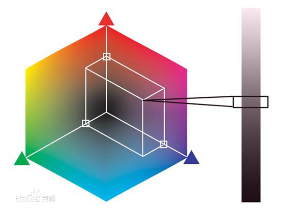

title: 音视频学习内容
author: patrick.dai
date: 2018-04-26

------------------------------------

# 数字视频格式

## 数字视频

+ 视频是由许多幅按照时间排列的连续图像组成
+ 帧(frame)  每幅完整图像为一帧

数字视频参数有：

+ 时间分辨率
+ 空间分辨率
+ 色彩空间
+ 量化深度 

视频格式：由视频参数组合为视频格式

一个视频序列可表示为
$$ f _x (m,n,k)$$

$$f _y (m,n,k)$$

$$ f _z (m,n,k)$$

k 表示的帧数，(m,n) 表示空间坐标 (x,y,z) 表示颜色空间
$$ f _x (m,n,k)$$ 表示第k帧在坐标(m,n)处 X 分量的幅度.

### 时间分辨率
单位： 每秒图像的帧数 fps(Frame per Second)
| 视频类型       | 分辨率     |
|:---------------|:-----------|
| 普通分辨率视频 | 30fps 以上 |
| 高清视频       | 60fps 以上 |

### 空间分辨率
图像的像素行数以及每行像素表示空间分辨率。空间分辨率越高，图像的细节就越清晰

### 色彩空间

色彩空间描述像素颜色的形式，一个彩色通常由三种分量描述。

#### 人类彩色感知
人体对光感受的细胞组成: 
+ 杆状细胞 Rods
+ 锥状细胞 Cones

杆状细胞对光敏感，对分辨率较差，不能分辨细节内容
锥状细胞信息：
| 细胞名称   | 感光波峰值    |
|:-----------|:--------------|
| L 锥状细胞 | 440 nm(蓝色)  |
| M 锥体细胞 | 540 nm(绿色)  |
| S 锥体细胞 | 570 nm (红色) |

#### 颜色空间
也叫彩色模型，目的是用标准方式对彩色加以说明。常见的颜色空间有 RGB CIECMY/CMYK、HSK NTSC、YcbCr、HSV、HIS 等，但是任何一个颜色模型都无法包含所有的可见光。

##### RGB 颜色空间
​        RGB（Red, Green, Blue）颜色模型通常使用于彩色阴极射管等彩色光栅图形显示设备中，彩色光栅图形的显示器都使用R、G、B数值来驱动R、G、B 电子枪发射电子，并分别激发荧光屏上的R、G、B三种颜色的荧光粉发出不同亮度的光线，并通过相加混合产生各种颜色。扫描仪也是通过吸收原稿经反射或透射而发送来 的光线中的R、G、B成分，并用它来表示原稿的颜色。

​         RGB颜色模型称为与设备相关的颜色模型，RGB颜色模型所覆盖的颜色域取决于显示设备荧光点的颜色特性，是与硬件相关的。它是我们使用最多，最熟悉的颜色模型。它采用三维直角坐标系。红、绿、蓝原色是加性原色，各个原色混合在一起可以产生复合色。如图所示：

​        RGB颜色模型通常采用如图所示的单位立方体来表示。在正方体的主对角线上，各原色的强度相等，产生由暗到明的白色，也就是不同的灰度值。（0，0，0）为黑色，（1，1，1）为白色。正方体的其他六个角点分别为红、黄、绿、青、蓝和品红。

##### YUV 颜色空间
​        Y 表示明亮度，也就是灰度； U V 表示的是色度，用于指定像素的颜色。

​	在现代彩色电视系统中，通常采用三管彩色摄像机或彩色CCD(点耦合器件)摄像机，它把摄得的彩色图像信号，经分色分别放大校正得到RGB，再经过矩阵变换电路得到亮度信号Y和两个色差信号R－Y、B－Y， 最后发送端将亮度和色差三个信号分别进行编码，用同一信道发送出去。这就是我们常用的YUV色彩空间。 采用YUV色彩空间的重要性是它的亮度信号Y和色度信号U、V是分离的。如果只有Y信号分量而没有U、V分量， 那么这样表示的图就是黑白灰度图。彩色电视采用YUV空间正是为了用亮度信号Y解决彩色电视机与黑白电视机 的兼容问题，使黑白电视机也能接收彩色信号。

​        根据美国国家电视制式委员会，NTSC制式的标准，当白光的亮度用Y来表示时，它和红、绿、蓝三色光的关系可用如下式的方程描述：Y=0.3R+0.59G+0.11B 这就是常用 的亮度公式。色差U、V是由B－Y、R－Y按不同比例压缩而成的。如果要由YUV空间转化成RGB空间，只要进行相反的逆运算即可。与YUV色彩空间类似的还有Lab色彩空间，它也是用亮度和色差来描述色彩分量，其中L为亮度、a和b分别为各色差分量。

##### YCbCr 颜色空间
与 YUV 颜色空间类似。
+ Y 表示明亮度

+ Cb 表示 RGB 输入信号蓝色部分与信号亮度值之间的差异

+ Cr 表示 RGB 输入信号红色部分与信号亮度值之间的差异
  YUV用于表示电视系统中向后兼容的模拟彩色信息，YCbCr颜色空间主要应用于图像、视频压缩的数字彩色信息表示，是YUV压缩和偏移的版本。

  YCbCr 与RGB(8 bit 量化深度)相互转化公式:

$$
\left[
\begin{matrix}
Y \\
Cb \\
Cr \\
\end{matrix}
\right]
=
\left[
\begin{matrix}
 0.299  &   0.587  &  0.114   \\
-0.169 &  -0.331  &  0.499    \\
0.499  &  -0.418  &  -0.0813 \\
\end{matrix}
\right]
\left[
\begin{matrix}
R \\
G \\
B \\
\end{matrix}
\right]
+
\left[
\begin{matrix}
0 \\
128 \\
128 \\
\end{matrix}
\right]
$$

$$
\left[
\begin{matrix}
R \\
G \\
B \\
\end{matrix}
\right]
=
\left[
\begin{matrix}
1.0 & 0.0    &  1.402 \\
1.0 & -0.344 & -0.714 \\
1.0 & 1.772  &  0.0   \\
\end{matrix}
\right]
\left[
\begin{matrix}
Y \\
Cb - 128 \\
Cr - 128 \\
\end{matrix}
\right]
$$

### 量化深度

像素每一分量的数值对应的量化等级称之为量化深度。量化深度越大，像素值可以越精确。

### 空间分辨率

数字图像由排列整齐的像素组成，通常表示为矩形像素阵，矩形内的元素对应图像中像素。像素矩阵的行列数用来表示图像空间分辨率。例如

高清视频空间分辨率为 1920 * 1080，表示每幅图像的像素矩阵有1920列，1080行

图像空间分辨率越高，图像包含的细节越多，高空间分辨率也是数字视频追求的目标

像素宽高比是指像素的宽度与高度的比值，像素宽高比是影响图像显示比例的关键因素，例如当空间分辨率为 

352 * 288 且像素宽高比为 12 : 11时，则图像的显示比例为传统的电视荧幕长宽比( 4:3 )

### 时间分辨率

视频的时间分辨率是指每秒的图像帧数（帧率），帧率越高视频的时域流畅性越好。

## 数字视频格式
数字视频采样方式有两种:

+ 使用相同的空间采样频率对图像的亮度信号和速度信号进行采样
+ 对亮度信号和色度信号分别采用不同的空间采样频率进行采样

色度亚采样： 对色度信号使用的空间采样频率比对亮度信号使用的空间采样频率低.

### 色度亚采样
实现原理，人眼对色度信号的敏感程度比亮度信号低的原理，将图像中表达颜色的信息去掉一些不被人察觉，所以对色度信号的采样率可以比亮度低。
常用的采样格式有: YCbCr 4:2:0、YCbCr 4:2:2、YCbCr 4:1:1和 YCbCr 4:4:4。

YCbCr 4:1:1 比较常用，含义：每一个点保存一个 8 bit 的亮度(Y值)，每 2 * 2 个点保存一个 Cr 和 Cb 值。例如原来使用 RGB(R, G, B 都是 8bit unsigned)模型,每个点需要 8 * 3=24 bits，现在仅 ８+(8/4) + (8/4) = 12 bits，平均每个点占用 12 bits ，这样把图像的数据压缩了一半。

#### YCbCr 4:4:4 格式

每个像素位置都有 Y  Cb Cr 分量，不论水平还是垂直方向。
每 4 个亮度样本都对应有 4 个 Cb 和 Cr 色度。
这种格式，色度分量和亮度分量具有相同的空间分辨率。

#### YCbCr 4:2:2 格式
在**水平方向**上，每 2 个 Y 样本有 1 个 Cb 和 1 个 Cr 样本。
图像显示时，对于没有 Cb 和 Cr 的样本，使用前后相邻的 Cb 和 Cr 计算得到。
这种格式，色度分量和亮度分量具有相同的垂直分辨率，但是前者色度的水平分辨率仅为后者的一半。

这就是彩色电视的标准格式。

#### YCbCr 4:1:1 格式
在**水平方向**上对色度分量进行4:1抽样，每 4个 Y 样本有 1 个 Cb 样本和 1 个Cr样本。

显示图像时，对于没有Cb和Cr的样本，使用前后相邻的Cb和Cr样本进行计算得到。

这种格式，色度分量和亮度分量具有相同的垂直分辨率，但色度分量水平分辨率是亮度分辨率的1/4。

主要使用在数字电视盒式磁带(Digital Video Cassette, DVC)

#### YCbCr 4:2:0 格式
该格式是 MPEG-2 编码标准中使用的视频格式。在水平和垂直方向上对色度分量都进行了2:1的抽样，即4个Ｙ样本对应１个Cb样本和１个Cr样本。
这种格式，色度分量在水平方向和垂直方向的分辨率都是亮度分量的1/2。

## H.265/HEVC 编码视频格式

```mermaid
graph LR;
　　视频源  --> 前端处理; 
　　前端处理 --> 编码器;
　　编码器 -->|信道| 解码器;
　　解码器 --> 后处理;
　　后处理 --> 恢复视频;
```
上图为一个视频通信的原理图：
不同格式的视频源经过前处理模块转换为统一的数据格式;
编解码器只需要应对少量几种统一的视频数据格式;
解码后的视频再经过后处理模块转换成与视频源格式一直的恢复视频;

H.265/HEVC 中编码视频只允许少量的格式，不同格式的编码视频采用较统一的数据结构；
编码器输出视频为解码视频，具有的格式信息为解码视频格式

### 编码图像格式

H.265/HEVC 编码视频采用统一的多级数据结构：
+ 编码视频为按顺序排列的图像序列
+ 图像为一个或多个长方形采样矩阵(每个矩阵对应亮度或者色度分量)
+ 像素对应矩阵的元素(元素值为像素的取值，元素的行列坐标表示像素空间位置)

H.265/HEVC 中，图像，可以是逐行扫描模式的视频帧、隔行扫描模式下的一场或者多场；
编码视频格式主要包括:

- 编码图像格式
  编码图像格式主要包括
  + 矩阵数量及空间关系
  + 图像空间分辨率
  + 像素量化深度

承载编码图像格式的语法元素属于序列参数集（Sequence Parameter Set, SPS）。SPS表征一组图像 CVS（Coded Video Sequence）的共有参数，一个 CVS 内的所有图像应具有相同的格式。

H.265/HEVC 仅规定了4类编码图像格式，每类对应不同的矩阵数量及相应的色度分量：

+ 仅有一个采样矩阵 Y，对应单色图像中的亮度分量(Luma)

+ 一个亮度分量的采样矩阵和两个色度分量的采样矩阵(YCbCr或YCgCo)

  这种格式对应所有亮度分量和两个色度分量的情况，具体对应的颜色空间为解码图像格式信息

+ 三个色度采样矩阵，分别为 绿  蓝  红(GBR)

+ 其他未指定的单色(Momo chrome) 或三激励彩色空间采样矩阵(YZX)

H.265/HEVC 已定义的色读格式（主要是描述亮度矩阵与色调矩阵的空间对应关系）

| chroma_format_idc | separate_colour_plane_flag | 色读格式 | SubWidthC | SubHeightC |
| :---------------: | :------------------------: | :------: | :-------: | :--------: |
|         0         |             0              |   单色   |           |            |
|         1         |             0              |  4:2:0   |     2     |     2      |
|         2         |             0              |  4:2:2   |     2     |     1      |
|         3         |             0              |  4:4:4   |     1     |     1      |
|         3         |             1              |  4:4:4   |     1     |     1      |

### 解码图像格式