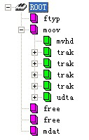

mp4 文件相关介绍

# 相关官方文档

+ [总体文档地址](http://standards.iso.org/ittf/PubliclyAvailableStandards/index.html)  
+ [cnblog mp4](https://www.cnblogs.com/ranson7zop/p/7889272.html)
+ [csdn mp4](https://blog.csdn.net/pirateleo/article/details/7061452)

# 概述

&emsp;&emsp;MP4文件中的所有数据都装在box（QuickTime中为atom）中，也就是说MP4文件由若干个box组成，每个box有类型和长度，可以将box理解为一个数据对象块。box中可以包含另一个box，这种box称为container box。一个MP4文件首先会有且只有一个“ftyp”类型的box，作为MP4格式的标志并包含关于文件的一些信息；之后会有且只有一个“moov”类型的box（Movie Box），它是一种container box，子box包含了媒体的metadata信息；MP4文件的媒体数据包含在“mdat”类型的box（Midia Data Box）中，该类型的box也是container box，可以有多个，也可以没有（当媒体数据全部引用其他文件时），媒体数据的结构由metadata进行描述。

基础概念： 

+ `track`  表示一些sample的集合，对于媒体数据来说，track表示一个视频或音频序列;
+ `hint track` 这个特殊的 track 并不包含媒体数据，而是包含了一些将其他数据track打包成流媒体的指示信息;
+ `sample`  对于非hint track来说，video sample即为一帧视频，或一组连续视频帧，audio sample即为一段连续的压缩音频，它们统称sample。对于hint track，sample定义一个或多个流媒体包的格式;
+ `sample table`  指明sampe时序和物理布局的表;
+ `chunk` 一个track的几个sample组成的单元

在本文中，我们不讨论涉及hint的内容，只关注包含媒体数据的本地MP4文件。下图为一个典型的MP4文件的结构树:

# Box 相关的说明
&emsp;&emsp;Box中的字节序为网络字节序，也就是大端字节序（Big-Endian），简单的说，就是一个32位的4字节整数存储方式为高位字节在内存的低端。Box 由 `header` 和`data` 组成。
- header 统一指明 Box 的大小和类型
- data 根据类型有不同的意义和格式

&emsp;&emsp;标准的 box 开头的4个字节（32位）为 Box 大小（该大小包括 header  data 整个box的大小），这样我们就可以在文件中定位各个box。  
&emsp;&emsp;如果size为1，则表示这个box的大小为large size，真正的size值要在largesize域上得到。（实际上只有“mdat”类型的box才有可能用到large size。）；  
&emsp;&emsp;如果size为0，表示该box为文件的最后一个box，文件结尾即为该box结尾。（同样只存在于“mdat”类型的box中。）  

1. `文件` 由许多 Box 和 FullBox 组成
2. `Box` 每个 Box 由 Header 和 body 组成 
3. `FullBox` Box 的扩展，Box结构的基础上在 Header 中增加 8 bits `version` 和24 bits `flags`
4. `Header` 包含了整个Box的长度size和类型type。当size==0时，代表这是文件中最后一个Box；当size==1时，意味着Box长度需要更多bits来描述，在后面会定义一个64bits的largesize描述Box的长度；当 type 是uuid时，代表Box中的数据是用户自定义扩展类型
5. `Data` Box 的实际数据，可以是纯数据也可以是更多的子Boxes
6. 当一个 Box 的 Data 中是一系列子 Box 时，这个Box又可成为 `Container Box`

如下为 Box 的相关图:

