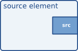

# Elements

Gstreamer 开发最重要的一个对象是  GstElement, element 是媒体管道的基本构建块, 所有使用的不同高级组件都来自基本的 GstElement 所有 decoder, encoder, demuxer, video 或者 audio 输出时间上都是一个 GstElement。

## What are elements?

对于应用程序程序员，elements 最好被可视化为黑箱。在一端，你可以把东西放进去，这个元素用它做了些什么，另一个东西就在另一边出来了。对于解码器元素，例如，您将放入编码数据，并且元素将输出解码数据。在下一章（请参阅Pad and Stand），您将了解更多关于元素中的数据输入和输出，以及如何在应用程序中设置这些数据。

## Source elements

Source elements generate data for use by a pipeline, for example reading from disk or from a sound card. Visualisation of a source element shows how we will visualise a source element. We always draw a source pad to the right of the element.  


Source elements do not accept data, they only generate data. You can see this in the figure because it only has a source pad (on the right). A source pad can only generate data.

## Filters, convertors, demuxers, muxers and codecs

Filters and filter-like elements 具有输入和输出 pads。他们操作他们的输入（sink）pad 上接收的数据，并且将提供他们的输出 (source) pad 数据。例如这样的 elements ,a volume element (filter), a video scaler (convertor), an Ogg demuxer or a Vorbis decoder. 如下的示意图:  


Filter-like elements 可以有任意数量的 source or sink pads。以视频解码为例，视频解析器将有一个 sink pad 和 几个（1-n）source pads，一个用于容器格式中包含的每个基本流。另一方面，解码器只会有一个 source and sink pads。如下图是一个 Filter-like elements。This specific element has one source and one sink element. Sink pads, receiving input data, are depicted at the left of the element; source pads are still on the right.  


## Sink elements

Sink elements are end points in a media pipeline. They accept data but do not produce anything. Disk writing, soundcard playback, and video output would all be implemented by sink elements. Visualisation of a sink element shows a sink element.  


## 相关使用

### 创建一个 GstElement

最简单的方式是通过函数 `gst_element_factory_make()` 来创建：
```c
GstElement *
gst_element_factory_make (const gchar *factoryname,
                          const gchar *name);
```
这个函数为新创建的 GstElement 取一个工厂名称和一个元素名称。 该元素名称可以在稍后的 bin 中查询对应的 element。该名称也将在调试输出中使用。
可以设置 name 为 NULL，意识自动生成唯一的默认名称。  
相关代码实现路径为: `gstreamer-1.14.2/gst/gstelementfactory.h(.c)`
```c
GstElement *
gst_element_factory_make (const gchar * factoryname, const gchar * name)
{
  GstElementFactory *factory;
  GstElement *element;

  g_return_val_if_fail (factoryname != NULL, NULL);
  g_return_val_if_fail (gst_is_initialized (), NULL);

  GST_LOG ("gstelementfactory: make \"%s\" \"%s\"",
      factoryname, GST_STR_NULL (name));

  factory = gst_element_factory_find (factoryname);
  if (factory == NULL)
    goto no_factory;

  GST_LOG_OBJECT (factory, "found factory %p", factory);
  element = gst_element_factory_create (factory, name);
  if (element == NULL)
    goto create_failed;

  gst_object_unref (factory);

  return element;

  /* ERRORS */
no_factory:
  {
    GST_WARNING ("no such element factory \"%s\"!", factoryname);
    return NULL;
  }
create_failed:
  {
    GST_INFO_OBJECT (factory, "couldn't create instance!");
    gst_object_unref (factory);
    return NULL;
  }
}
```
最终调用的是 g_object_new 函数，来创建一个 GstElement 。  

当你不需要 element 时，需要使用函数 [gst_object_unref()](https://gstreamer.freedesktop.org/data/doc/gstreamer/stable/gstreamer/html/GstObject.html#gst-object-unref) 将对应的引用计数 -1。
```c
void
gst_object_unref (gpointer object);
```

相关代码实现路径为: `gstreamer-1.14.2/gst/gstobject.h(.c)`
```c
void
gst_object_unref (gpointer object)
{
  g_return_if_fail (object != NULL);
  g_return_if_fail (((GObject *) object)->ref_count > 0);

  GST_TRACER_OBJECT_UNREFFED (object, ((GObject *) object)->ref_count - 1);
#ifdef DEBUG_REFCOUNT
  GST_CAT_TRACE_OBJECT (GST_CAT_REFCOUNTING, object, "%p unref %d->%d", object,
      ((GObject *) object)->ref_count, ((GObject *) object)->ref_count - 1);
#endif
  g_object_unref (object);
}
```

从上面的 `gst_element_factory_make` 的代码实现可以看到，调用了两个函数：  
+ gst_element_factory_find
```c
GstElementFactory *
gst_element_factory_find (const gchar *name);
```
gst_element_factory_find 返回的是一个 GstElementFactory  
入参是一个 factory 的名称

+ gst_element_factory_create
```c
GstElement *
gst_element_factory_create (GstElementFactory *factory,
                            const gchar *name);
```
入参为: GstElementFactory*   
       name 读应 `gst_element_factory_make` 第二个入参 name, NULL 为使用默认的, 或者非空指定name


### Using an element as a GObject

A GstElement can have several properties which are implemented using standard GObject properties. The usual GObject methods to query, set and get property values and GParamSpecs are therefore supported.  

Every GstElement inherits at least one property from its parent GstObject: the "name" property. This is the name you provide to the functions gst_element_factory_make () or gst_element_factory_create (). You can get and set this property using the functions gst_object_set_name and gst_object_get_name or use the GObject property mechanism as shown below.

```c
#include <gst/gst.h>

int
main (int   argc,
      char *argv[])
{
  GstElement *element;
  gchar *name;

  /* init GStreamer */
  gst_init (&argc, &argv);

  /* create element */
  element = gst_element_factory_make ("fakesrc", "source");

  /* get name */
  g_object_get (G_OBJECT (element), "name", &name, NULL);
  g_print ("The name of the element is '%s'.\n", name);
  g_free (name);

  gst_object_unref (GST_OBJECT (element));

  return 0;
}

```


### More about element factories(更多的 element 工厂)

元素工厂是从 GStreamer 注册表中检索的基本类型，它们描述了 GStreamer 可以创建的所有插件和元素。这意味着元素工厂对于自动化元素实例化非常有用，例如自动插入器所做的事情，以及创建可用元素列表。可以阅读如下的代码：[code file](../code/offical_element_01.c)


### Finding out what pads an element can contain

也许`元素工厂`最强大的特性是它们包含了可以生成 element 的 pad 的完整描述，以及这些 pad 的能力（换句话说：什么类型的媒体数据可以在这些 pad 上流动），而实际上不必将这些插件加载到内存中。这样可以用于提供一个编码器的编解码器选择列表，或者它可以用于自动插入媒体播放器的目的。所有当前基于 gstreamer 媒体播放器和自动插件都是这样工作的。
当我们在下一章了解 GstPad 和  GstCaps 时，我们将仔细研究这些特性：Pads and capabilities。  


## Linking elements

通过将一个 source element 与零个或更多的  filter-like elements 和 finally a sink element 链接，可以建立媒体管道。数据将流过元素。这是GStreamer媒体处理的基本概念。


通过链接这三个元素，我们创建了一个非常简单的元素链。这样做的效果将是源元素（(“element1”) 的输出将被用作 filter-like element (“element2”) 的输入。
The filter-like element will do something with the data and send the result to the final sink element (“element3”).

```c
#include <gst/gst.h>

int
main (int   argc,
      char *argv[])
{
  GstElement *pipeline;
  GstElement *source, *filter, *sink;

  /* init */
  gst_init (&argc, &argv);

  /* create pipeline */
  pipeline = gst_pipeline_new ("my-pipeline");

  /* create elements */
  source = gst_element_factory_make ("fakesrc", "source");
  filter = gst_element_factory_make ("identity", "filter");
  sink = gst_element_factory_make ("fakesink", "sink");

  /* must add elements to pipeline before linking them */
  gst_bin_add_many (GST_BIN (pipeline), source, filter, sink, NULL);

  /* link */
  if (!gst_element_link_many (source, filter, sink, NULL)) {
    g_warning ("Failed to link elements!");
  }

[..]

}
```
先需要加入到一个 pipeline bin 然后才能链接。

+ gst_bin_add_many
`gstreamer-1.14.2/gst/gstutils.h(.c)`
```c
void
gst_bin_add_many (GstBin * bin, GstElement * element_1, ...)
{
  va_list args;

  g_return_if_fail (GST_IS_BIN (bin));
  g_return_if_fail (GST_IS_ELEMENT (element_1));

  va_start (args, element_1);

  while (element_1) {
    gst_bin_add (bin, element_1);

    element_1 = va_arg (args, GstElement *);
  }

  va_end (args);
}
```
一个个调用 gst_bin_add 代码位置: `gstreamer-1.14.2/gst/gstbin.h(.c)`


## Element States

在创建之后，元素将不会实际执行任何动作。你需要改变元素状态，使它做一些事情。GStreamer 有四个元素的状态，每个都有一个非常具体的含义。这四种状态是：  
`GST_STATE_NULL`，`GST_STATE_READY`，`GST_STATE_PAUSED`，`GST_STATE_PLAYING`  
这些状态定义在 `gstreamer-1.14.2/gst/gstelement.h` 下的枚举类型 `GstState` 内。
+ GST_STATE_NULL
这是默认状态。在该状态中没有分配资源，因此，转换到该状态后将释放所有资源。当引用计数达到0并且释放时，该元素必须处于该状态。

+ GST_STATE_READY
在就绪状态下，一个 element 已经分配了它的所有全局资源，即可以保存在流中的资源。我们可以考虑打开设备、分配缓冲区等等。
但是，在该状态下，流不会打开，因此流位置自动为零。如果先前打开了流，则应该在该状态下关闭，并且位置、属性等应被重置。

+ GST_STATE_PAUSED
在这种状态下，element 打开了流，但没有主动处理它。一个元素被允许修改一个流的位置，读取和处理数据，并且在状态被改变为 PLAYING时准备回放，
但是它不允许播放使时钟运行的数据。总而言之，PAUSED 与 PLAYING 是一样的只是没有运行时钟。  

进入暂停状态的 element 应该尽快转移到 PLAYING 状态。例如，视频或音频输出会等待数据到达并将其赛入队列，这样他们就可以在状态改变之后播放它。
此外，视频接收器已经可以播放第一帧（因为这还不影响时钟）。自动插入器可以使用相同的状态转换来将管道连接在一起。然而大多数其他元素，如编解码器或过滤器，不需要明确地在这种状态下做任何事情。

+ GST_STATE_PLAYING
在播放状态中，除了时钟现在运行外，元素与暂停状态完全相同。

可以通过 gst_element_set_state 去改变 element。 如果将元素设置为另一个状态，Gstreamer 将在内部遍历所有中间状态。
因此，如果将元素从 NULL 设置为 PLAYING，GStreamer将在内部将元素设置为 READY 并在其间 PAUSED 。  

当移动到 GST_STATE_PLAYING 播放时，管道将自动处理数据。它们不需要以任何形式迭代。在内部，Gstreamer 将启动线程，把这个任务交给他们。
GStreamer 还将通过使用 `GstBus` 来处理从管道的线程切换到应用程序自身线程的消息。  

当将容器或管道设置为某个目标状态时，它通常会自动将状态更改传播到容器或管道内的所有元素，因此通常只需要设置顶级管道的状态来启动管道或关闭管道。
但是，当将动态地添加 element 到已经运行的管道中时，例如从 "pad-added" 的信号回调中，您需要自己使用 `gst_element_set_state()` or `gst_element_sync_state_with_parent()` 来将其设置为所需的目标状态。
