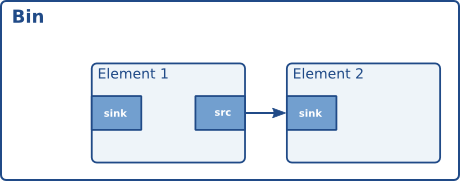

# Elements

[gstreamer 官网地址](https://gstreamer.freedesktop.org/documentation/application-development/basics/elements.html#visualisation-of-a-source-element)

Gstreamer 开发最重要的一个对象是  GstElement, element 是媒体管道的基本构建块, 所有使用的不同高级组件都来自基本的 GstElement 所有 decoder, encoder, demuxer, video 或者 audio 输出时间上都是一个 GstElement。

## What are elements?

对于应用程序程序员，elements 最好被可视化为黑箱。在一端，你可以把东西放进去，这个元素用它做了些什么，另一个东西就在另一边出来了。对于解码器元素，例如，您将放入编码数据，并且元素将输出解码数据。在下一章（请参阅Pad and Stand），您将了解更多关于元素中的数据输入和输出，以及如何在应用程序中设置这些数据。

## Source elements

Source elements generate data for use by a pipeline, for example reading from disk or from a sound card. Visualisation of a source element shows how we will visualise a source element. We always draw a source pad to the right of the element.  


Source elements do not accept data, they only generate data. You can see this in the figure because it only has a source pad (on the right). A source pad can only generate data.

## Filters, convertors, demuxers, muxers and codecs

Filters and filter-like elements 具有输入和输出 pads。他们操作他们的输入（sink）pad 上接收的数据，并且将提供他们的输出 (source) pad 数据。例如这样的 elements ,a volume element (filter), a video scaler (convertor), an Ogg demuxer or a Vorbis decoder. 如下的示意图:  


Filter-like elements 可以有任意数量的 source or sink pads。以视频解码为例，视频解析器将有一个 sink pad 和 几个（1-n）source pads，一个用于容器格式中包含的每个基本流。另一方面，解码器只会有一个 source and sink pads。如下图是一个 Filter-like elements。This specific element has one source and one sink element. Sink pads, receiving input data, are depicted at the left of the element; source pads are still on the right.  


## Sink elements

Sink elements are end points in a media pipeline. They accept data but do not produce anything. Disk writing, soundcard playback, and video output would all be implemented by sink elements. Visualisation of a sink element shows a sink element.  


## 相关使用

### 创建一个 GstElement

最简单的方式是通过函数 `gst_element_factory_make()` 来创建：
```c
GstElement *
gst_element_factory_make (const gchar *factoryname,
                          const gchar *name);
```
这个函数为新创建的 GstElement 取一个工厂名称和一个元素名称。 该元素名称可以在稍后的 bin 中查询对应的 element。该名称也将在调试输出中使用。
可以设置 name 为 NULL，意识自动生成唯一的默认名称。  
相关代码实现路径为: `gstreamer-1.14.2/gst/gstelementfactory.h(.c)`
```c
GstElement *
gst_element_factory_make (const gchar * factoryname, const gchar * name)
{
  GstElementFactory *factory;
  GstElement *element;

  g_return_val_if_fail (factoryname != NULL, NULL);
  g_return_val_if_fail (gst_is_initialized (), NULL);

  GST_LOG ("gstelementfactory: make \"%s\" \"%s\"",
      factoryname, GST_STR_NULL (name));

  factory = gst_element_factory_find (factoryname);
  if (factory == NULL)
    goto no_factory;

  GST_LOG_OBJECT (factory, "found factory %p", factory);
  element = gst_element_factory_create (factory, name);
  if (element == NULL)
    goto create_failed;

  gst_object_unref (factory);

  return element;

  /* ERRORS */
no_factory:
  {
    GST_WARNING ("no such element factory \"%s\"!", factoryname);
    return NULL;
  }
create_failed:
  {
    GST_INFO_OBJECT (factory, "couldn't create instance!");
    gst_object_unref (factory);
    return NULL;
  }
}
```
最终调用的是 g_object_new 函数，来创建一个 GstElement 。  

当你不需要 element 时，需要使用函数 [gst_object_unref()](https://gstreamer.freedesktop.org/data/doc/gstreamer/stable/gstreamer/html/GstObject.html#gst-object-unref) 将对应的引用计数 -1。
```c
void
gst_object_unref (gpointer object);
```

相关代码实现路径为: `gstreamer-1.14.2/gst/gstobject.h(.c)`
```c
void
gst_object_unref (gpointer object)
{
  g_return_if_fail (object != NULL);
  g_return_if_fail (((GObject *) object)->ref_count > 0);

  GST_TRACER_OBJECT_UNREFFED (object, ((GObject *) object)->ref_count - 1);
#ifdef DEBUG_REFCOUNT
  GST_CAT_TRACE_OBJECT (GST_CAT_REFCOUNTING, object, "%p unref %d->%d", object,
      ((GObject *) object)->ref_count, ((GObject *) object)->ref_count - 1);
#endif
  g_object_unref (object);
}
```

从上面的 `gst_element_factory_make` 的代码实现可以看到，调用了两个函数：  
+ gst_element_factory_find
```c
GstElementFactory *
gst_element_factory_find (const gchar *name);
```
gst_element_factory_find 返回的是一个 GstElementFactory  
入参是一个 factory 的名称

+ gst_element_factory_create
```c
GstElement *
gst_element_factory_create (GstElementFactory *factory,
                            const gchar *name);
```
入参为: GstElementFactory*   
       name 读应 `gst_element_factory_make` 第二个入参 name, NULL 为使用默认的, 或者非空指定name


### Using an element as a GObject

A GstElement can have several properties which are implemented using standard GObject properties. The usual GObject methods to query, set and get property values and GParamSpecs are therefore supported.  

Every GstElement inherits at least one property from its parent GstObject: the "name" property. This is the name you provide to the functions gst_element_factory_make () or gst_element_factory_create (). You can get and set this property using the functions gst_object_set_name and gst_object_get_name or use the GObject property mechanism as shown below.

```c
#include <gst/gst.h>

int
main (int   argc,
      char *argv[])
{
  GstElement *element;
  gchar *name;

  /* init GStreamer */
  gst_init (&argc, &argv);

  /* create element */
  element = gst_element_factory_make ("fakesrc", "source");

  /* get name */
  g_object_get (G_OBJECT (element), "name", &name, NULL);
  g_print ("The name of the element is '%s'.\n", name);
  g_free (name);

  gst_object_unref (GST_OBJECT (element));

  return 0;
}

```


### More about element factories(更多的 element 工厂)

元素工厂是从 GStreamer 注册表中检索的基本类型，它们描述了 GStreamer 可以创建的所有插件和元素。这意味着元素工厂对于自动化元素实例化非常有用，例如自动插入器所做的事情，以及创建可用元素列表。可以阅读如下的代码：[code file](../code/offical_element_01.c)


### Finding out what pads an element can contain

也许`元素工厂`最强大的特性是它们包含了可以生成 element 的 pad 的完整描述，以及这些 pad 的能力（换句话说：什么类型的媒体数据可以在这些 pad 上流动），而实际上不必将这些插件加载到内存中。这样可以用于提供一个编码器的编解码器选择列表，或者它可以用于自动插入媒体播放器的目的。所有当前基于 gstreamer 媒体播放器和自动插件都是这样工作的。
当我们在下一章了解 GstPad 和  GstCaps 时，我们将仔细研究这些特性：Pads and capabilities。  


## Linking elements

通过将一个 source element 与零个或更多的  filter-like elements 和 finally a sink element 链接，可以建立媒体管道。数据将流过元素。这是GStreamer媒体处理的基本概念。  


通过链接这三个元素，我们创建了一个非常简单的元素链。这样做的效果将是源元素（(“element1”) 的输出将被用作 filter-like element (“element2”) 的输入。
The filter-like element will do something with the data and send the result to the final sink element (“element3”).

```c
#include <gst/gst.h>

int
main (int   argc,
      char *argv[])
{
  GstElement *pipeline;
  GstElement *source, *filter, *sink;

  /* init */
  gst_init (&argc, &argv);

  /* create pipeline */
  pipeline = gst_pipeline_new ("my-pipeline");

  /* create elements */
  source = gst_element_factory_make ("fakesrc", "source");
  filter = gst_element_factory_make ("identity", "filter");
  sink = gst_element_factory_make ("fakesink", "sink");

  /* must add elements to pipeline before linking them */
  gst_bin_add_many (GST_BIN (pipeline), source, filter, sink, NULL);

  /* link */
  if (!gst_element_link_many (source, filter, sink, NULL)) {
    g_warning ("Failed to link elements!");
  }

[..]

}
```
先需要加入到一个 pipeline bin 然后才能链接。

+ gst_bin_add_many
`gstreamer-1.14.2/gst/gstutils.h(.c)`
```c
void
gst_bin_add_many (GstBin * bin, GstElement * element_1, ...)
{
  va_list args;

  g_return_if_fail (GST_IS_BIN (bin));
  g_return_if_fail (GST_IS_ELEMENT (element_1));

  va_start (args, element_1);

  while (element_1) {
    gst_bin_add (bin, element_1);

    element_1 = va_arg (args, GstElement *);
  }

  va_end (args);
}
```
一个个调用 gst_bin_add 代码位置: `gstreamer-1.14.2/gst/gstbin.h(.c)`


## Element States

在创建之后，元素将不会实际执行任何动作。你需要改变元素状态，使它做一些事情。GStreamer 有四个元素的状态，每个都有一个非常具体的含义。这四种状态是：  
`GST_STATE_NULL`，`GST_STATE_READY`，`GST_STATE_PAUSED`，`GST_STATE_PLAYING`  
这些状态定义在 `gstreamer-1.14.2/gst/gstelement.h` 下的枚举类型 `GstState` 内。
+ GST_STATE_NULL
这是默认状态。在该状态中没有分配资源，因此，转换到该状态后将释放所有资源。当引用计数达到0并且释放时，该元素必须处于该状态。

+ GST_STATE_READY
在就绪状态下，一个 element 已经分配了它的所有全局资源，即可以保存在流中的资源。我们可以考虑打开设备、分配缓冲区等等。
但是，在该状态下，流不会打开，因此流位置自动为零。如果先前打开了流，则应该在该状态下关闭，并且位置、属性等应被重置。

+ GST_STATE_PAUSED
在这种状态下，element 打开了流，但没有主动处理它。一个元素被允许修改一个流的位置，读取和处理数据，并且在状态被改变为 PLAYING时准备回放，
但是它不允许播放使时钟运行的数据。总而言之，PAUSED 与 PLAYING 是一样的只是没有运行时钟。  

进入暂停状态的 element 应该尽快转移到 PLAYING 状态。例如，视频或音频输出会等待数据到达并将其赛入队列，这样他们就可以在状态改变之后播放它。
此外，视频接收器已经可以播放第一帧（因为这还不影响时钟）。自动插入器可以使用相同的状态转换来将管道连接在一起。然而大多数其他元素，如编解码器或过滤器，不需要明确地在这种状态下做任何事情。

+ GST_STATE_PLAYING
在播放状态中，除了时钟现在运行外，元素与暂停状态完全相同。

可以通过 gst_element_set_state 去改变 element。 如果将元素设置为另一个状态，Gstreamer 将在内部遍历所有中间状态。
因此，如果将元素从 NULL 设置为 PLAYING，GStreamer将在内部将元素设置为 READY 并在其间 PAUSED 。  

当移动到 GST_STATE_PLAYING 播放时，管道将自动处理数据。它们不需要以任何形式迭代。在内部，Gstreamer 将启动线程，把这个任务交给他们。
GStreamer 还将通过使用 `GstBus` 来处理从管道的线程切换到应用程序自身线程的消息。  

当将容器或管道设置为某个目标状态时，它通常会自动将状态更改传播到容器或管道内的所有元素，因此通常只需要设置顶级管道的状态来启动管道或关闭管道。
但是，当将动态地添加 element 到已经运行的管道中时，例如从 "pad-added" 的信号回调中，您需要自己使用 `gst_element_set_state()` or `gst_element_sync_state_with_parent()` 来将其设置为所需的目标状态。


# Bins

[Offical document about bins](https://gstreamer.freedesktop.org/documentation/application-development/basics/bins.html)

bin 是一个 element 容器。可以将元素添加到 bin 中。由于bin本身是一个 element ，所以可以用与任何其他 element 相同的方式来处理 bin。因此，整个前一章（element）也适用于 bin。


## What are bins

Bins 允许您将一组链接元素组合成一个逻辑元素。你不再处理单独的元素，而是只使用一个元素 -- bin。
我们将看到，这将是非常强大的，当你要构建复杂的 pipelines ，因为它允许你以较小的块打破管道。  

bin 也将管理包含在其中的元素。它将执行元素上的状态变化以及收集和转发总线消息。  


有一种特殊类型的 bin 可供 GStreamer 程序员使用：
+ A pipeline: 管理包含元素的同步和总线消息的通用容器。
The toplevel bin has to be a pipeline，因此每个应用程序都需要至少其中一个。


## Creating a bin

Bins are created in the same way that other elements are created, i.e. using an element factory. 
There are also convenience functions available (`gst_bin_new()` and `gst_pipeline_new()`). 
To add elements to a bin or remove elements from a bin, you can use `gst_bin_add()` and `gst_bin_remove()`.
注意: 被添加的 element, bin 将获得其所有权。如果您销毁了 bin，则元素将被解除引用。如果从 bin 中删除元素，则将自动`解引用`该元素。

```c
#include <gst/gst.h>

int main (int argc, char *argv[])
{
    GstElement *bin, *pipeline, *source, *sink;

    /* init */
    gst_init (&argc, &argv);

    /* create */
    pipeline = gst_pipeline_new ("my_pipeline");
    bin      = gst_bin_new ("my_bin");
    source   = gst_element_factory_make ("fakesrc", "source");
    sink     = gst_element_factory_make ("fakesink", "sink");

    /* First add the elements to the bin */
    gst_bin_add_many (GST_BIN (bin), source, sink, NULL);
    /* add the bin to the pipeline */
    gst_bin_add (GST_BIN (pipeline), bin);

    /* link the elements */
    gst_element_link (source, sink);

    // [...]
}
```

在bin中查找元素有多种方法，最常用的是 `gst_bin_get_by_name()` 和 `gst_bin_get_by_interface()`。 还可以使用函数 `gst_bin_iterate_elements()` 来迭代 bin 所包含的所有元素。有关详细信息，请参见 [GstBin](https://gstreamer.freedesktop.org/data/doc/gstreamer/stable/gstreamer/html/GstBin.html) 的 API 引用。


## Bins manage states of their children

​        Bins 管理包含在其中的所有元素的状态。如果将一个 bin（或一个pipeline, 它是一个特殊的顶级类型的 bin）使用函数 `gst_element_set_state()` 设置为某个目标 state，它将确保包含在它里面的所有元素也将被设置为这个状态。这意味着通常只需要设置顶级管道的 state 来启动管道或关闭管道。

​        Bins 将对其所有子元素从 sink element 到  source element 执行状态更改。当上游元件被 PAUSED or PLAYING 时, 确保下游元件已经准备好接收数据。同样，当关闭时 sink elements 将首先被设置为 READY or NULL，这将导致上游元件接收一个 FLUSHING 错误并在 sink elements 被设置为 READY or NULL状态前，停止 数据流线程。

​        请注意：如果元素被添加到已经运行的 bin 或 pipeline 中，比如如从一个 "pad-added" 信号回调中，它的状态将不会自动地与它添加到的bin或管道的当前状态或目标状态一致。相反，你需要将它设置为所需的目标国家自己使用 `gst_element_set_state()` or `gst_element_sync_state_with_parent()` 对已运行的管道添加元素时。


# Bus

[Offical Document about bus](https://gstreamer.freedesktop.org/documentation/application-development/basics/bus.html)

​         Bus 是一个简单的系统，它负责将来自数据流线程的消息转发到应用程序其自身上下文中的线程。总线的优点是 gstreamer 应用程序不需要 thread-aware 的，以便使用gStuffER，即使 GStreamer 本身本身也很线程化。

​        Every pipeline contains a bus by default, so applications do not need to create a bus or anything. The only thing applications should do is set a message handler on a bus, which is similar to a signal handler to an object. When the mainloop is running, the bus will periodically be checked for new messages, and the callback will be called when any message is available.


## How to use a bus

有两个方式使用 bus:

+ 运行一个 GLib/Gtk+ main loop（或定期迭代的默认 GLib main 上下文）并在 bus 上附件一些列的 watch。 这样，GLib main loop 将检查消息总线新的消息并且每当有消息时会通知你。

  ​	这种情况下可以使用 `gst_bus_add_watch()` 或者 `gst_bus_add_signal_watch()`
  使用总线，附加一个消息处理 handler 到管道使用函数 `gst_bus_add_watch()`。 当管道发送消息到总线时，该 handler 将被调用。在这个 handler里，检查信号类型,和相应的做 handler 执行内容。handler 的返回值：
  	TRUE : to keep the handler attached to the bus.
  	FALSE: to remove it.

+ Check for messages on the bus yourself. This can be done using `gst_bus_peek()` and/or `gst_bus_poll()`.

可以查看代码 [bus use code -1](../code/offical_bus_way1.c)


知道 handler 是在 mainloop 的上下文线程中被调用的是非常重要。这意味着 pipeline 和 application 之间总线交互是异步的，因此不适合一些实时的目的，such as cross-fading between audio tracks, doing (theoretically) gapless playback or video effects. 所有这些事情应该在 pipeline 的上下文进行的，上面的代码是编写的一个最简单的 GStreamer 插件。这是非常有用的为主要目的，但从管道传递消息的应用。这种方法的优点是，所有的线程，GStreamer 是内部隐藏，应用程序开发人员不必担心应用线程的问题。 

注意： 如果使用默认的 GLib mainloop 集成，您可以在总线上连接 "message" signal，而不是附加 watch。这样你就不必 `switch()` 在所有可能的消息类型；只是连接到感兴趣的消息类型上，消息为 message::<type>，<type> 下一节介绍。可以见代码: [offical_bus_way2](../code/offical_bus_way2.c)


## Message types

GStreamer 有一些预先定义的消息类型，可以通过总线。然而，messages 是可扩展的。插件可以定义额外的 messages，并且应用程序可以决定是 have specific code 或忽视他们。强烈建议所有的应用程序至少处理错误信息，给用户提供视觉反馈。

所有消息都有 message source, type and timestamp。message source 可以看到元件发出的消息。对于一些信息，例如，应用程序只对 top-level 感兴趣（例如状态更改通知）。下面列表中是所有消息和消息简短的解释其做什么和如何解析消息的具体内容：

+ [ ]  Error, warning and information notifications  
those are used by elements if a message should be shown to the user bout the state of the pipeline.  
Error &emsp;&emsp;&emsp;&emsp; 消息是致命的，并终止数据传递, error 应该修复并 resume pipeline activity  
Warnings &emsp;&emsp; 消息不是致命的，但意味存在一个问题  
Information &emsp; 消息用于非问题通知  
All those messages contain a `GError` with the main error type and essage, and optionally a debug string.  
这些消息可以通过使用:

```
gst_message_parse_error()
gst_message__parse_warning()
gst_message_parse_info()
```

另外 error and debug strings should be `freed` after use。

+ [ ] End-of-stream notification  
&emsp;&emsp;这种情况在流结束时发出。The state of the pipeline will not change，但进一步的媒体处理将停滞。应用程序可以使用它跳过播放列表中的下一首歌曲。流结束后，也有可能在流中寻找回，回放将自动继续。此消息没有特定的参数。

+ [ ] Tags  
&emsp;&emsp; 在流中找到元数据时发出该消息。这可以多次触发用于 pipeline（例如一次用于描述性元数据，例如艺术家名称或歌曲标题，另一个用于流信息，例如 samplerate and bitrate ）。应用程序应该在内部缓存元数据。应该使用 `gst_message_parse_tag()` 来分析标签列表，该标签列表在不再需要时使用 `gst_tag_list_unref ()` 进行释放。  

+ [ ] State-changes  
&emsp;&emsp; 状态成功转变后触发该事件. `gst_message_parse_state_changed()` 可以用于解析新旧抓状态的改变。  

+ [ ] Buffering  
&emsp;&emsp; 在网络流缓存期间发出。通过从 `gst_message_get_structure()` 返回的结构中提取“缓冲区百分比”属性，可以手动从消息中提取进度（百分比）。

+ [ ] Element messages  
&emsp;&emsp; 这些是特定元素特有的特殊消息，通常表示附加的特征。元素的文档应该详细提及特定元素可能发送的元素消息。作为一个例子，如果流包含重定向指令，'qtdemux' QuickTime demuxer element 可以在某些场合发送“重定向”元素消息。 

+ [ ] Application-specific messages  
&emsp;&emsp; 通过获取消息结构（见上文）并读取其字段，可以提取关于这些的任何信息。通常这些信息可以被安全地忽略。  
&emsp;&emsp; 应用程序消息主要用于在应用程序内部使用，以防应用程序需要将信息从某个线程封送到主线程中。当应用程序使用元素信号时，这是特别有用的（因为这些信号将在流线程的上下文中发射）。


# Pads and capabilities

&emsp;&emsp; As we have seen in Elements, the pads are the element's interface to the outside world. Data streams from one element's source pad to another element's sink pad. The specific type of media that the element can handle will be exposed by the pad's capabilities. We will talk more on capabilities later in this chapter (see Capabilities of a pad).


## Pads

[offical document about Pads](https://gstreamer.freedesktop.org/documentation/application-development/basics/pads.html)

Pads 有两个属性: 方向性和时效性。  

+ 方向性 GStreamer defines two pad directions: source pads and sink pads.  
 elements receive data on their sink pads and generate data on their source pads. 

+ 时效性 三种时效性  
A pad can have any of three availabilities: `always`, `sometimes` and `on request`.  
`always pads` always exist  
`sometimes pad` 只存在于某些情况下（并且可以随机消失）  
`on-request pads` 只有当应用程序明确请求时，才会出现  


## Capabilities of a pad (Pads 的能力)

&emsp;&emsp; Capabilities 已经附加到 pad 模板 并作用到 pad 上。对于 pad 模板可以描述为从该模板创建的 pad 上流的媒体类型。 对于 pads 既可能是 caps 列表（通常是 pad 模板能力的一份拷贝），这种情况下 pad 还没有协商好; 也可能是当前流过 pad 数据流媒体的类型，这种情况下 pad 是协商好的。  

:question: ``这里协商好与没有协商好的意思不是很清晰，后续需要搞清楚``


### Dissecting capabilities 解剖能力

&emsp;&emsp;A pad's capabilities are described in a `GstCaps` object. Internally, a `GstCaps` will contain one or more `GstStructure` that will describe one media type. 一个协商好的 pad 将具有完全包含一个结构的能力集合。同时，该结构将只包含固定值。这些约束对于未协商的 pads 或 pad templates 是不正确的。  
可以使用 `gst-inspect-1.0 vorbisdec` 命令去 dump 一下相关信息例如：
```shell
root@com:etc# gst-inspect-1.0 vorbisdec
Factory Details:
  Rank                     primary (256)
  Long-name                Vorbis audio decoder
  Klass                    Codec/Decoder/Audio
  Description              decode raw vorbis streams to float audio
  Author                   Benjamin Otte <otte@gnome.org>, Chris Lord <chris@openedhand.com>

Plugin Details:
  Name                     vorbis
  Description              Vorbis plugin library
  Filename                 /usr/lib/x86_64-linux-gnu/gstreamer-1.0/libgstvorbis.so
  Version                  1.14.1
  License                  LGPL
  Source module            gst-plugins-base
  Source release date      2018-05-17
  Binary package           GStreamer Base Plugins (Ubuntu)
  Origin URL               https://launchpad.net/distros/ubuntu/+source/gst-plugins-base1.0

GObject
 +----GInitiallyUnowned
       +----GstObject
             +----GstElement
                   +----GstAudioDecoder
                         +----GstVorbisDec

Pad Templates:
  SINK template: 'sink'
    Availability: Always
    Capabilities:
      audio/x-vorbis
  
  SRC template: 'src'
    Availability: Always
    Capabilities:
      audio/x-raw
                 format: F32LE
                   rate: [ 1, 2147483647 ]
               channels: [ 1, 256 ]

Element has no clocking capabilities.
Element has no URI handling capabilities.

Pads:
  SINK: 'sink'
    Pad Template: 'sink'
  SRC: 'src'
    Pad Template: 'src'

Element Properties:
  name                : The name of the object
                        flags: readable, writable
                        String. Default: "vorbisdec0"
  parent              : The parent of the object
                        flags: readable, writable
                        Object of type "GstObject"
  min-latency         : Aggregate output data to a minimum of latency time (ns)
                        flags: readable, writable
                        Integer64. Range: 0 - 9223372036854775807 Default: 0 
  tolerance           : Perfect ts while timestamp jitter/imperfection within tolerance (ns)
                        flags: readable, writable
                        Integer64. Range: 0 - 9223372036854775807 Default: 0 
  plc                 : Perform packet loss concealment (if supported)
                        flags: readable, writable
                        Boolean. Default: false
root@com:etc# 
```

### Properties and values

&emsp;&emsp; Properties are used to describe extra information for capabilities. A property consists of a key (a string) and a value. There are different possible value types that can be used:  

+ Basic types  
他可以与 Glib 注册的任何 GType 差不多。这些属性指示此属性的特定非动态值。例子包括： 
  - An integer value (G_TYPE_INT): the property has this exact value.
  - A boolean value (G_TYPE_BOOLEAN): the property is either TRUE or FALSE.
  - A float value (G_TYPE_FLOAT): the property has this exact floating point value.
  - A string value (G_TYPE_STRING): the property contains a UTF-8 string.
  - A fraction value (GST_TYPE_FRACTION): contains a fraction expressed by an integer numerator and denominator.

+ Range types  
Range types 是 GStreamer 注册的 `GType`，以指示可能的值的范围。它们用于指示允许的音频采样值或支持的视频大小。GStreamer定义的两种类型是：
  - An integer range value (GST_TYPE_INT_RANGE): 属性表示一个可能的整数的范围，具有一个下界和一个上边界。例如，"vorbisdec" 元素的速率属性可以在8000到50000之间。
  - A float range value (GST_TYPE_FLOAT_RANGE): 该属性表示可能的浮点值的范围，具有下界和上边界。
  - A fraction range value (GST_TYPE_FRACTION_RANGE): 该属性表示一个可能的分数值的范围，具有下界和上边界。

+ A list value (GST_TYPE_LIST)  
属性可以从列表中给出的基本值列表中获取任何值。

+ An array value (GST_TYPE_ARRAY):  
属性是一个值数组。数组中的每个值本身也是一个完全值。数组中的所有值都应该是相同的基本类型。这意味着一个数组可以包含整数、整数列表、整数范围的任何组合，并且对于浮点数或字符串都是相同的，但是它不能同时包含浮点和int。  


### What capabilities are used for

&emsp;&emsp; Capabilities (short: caps) describe the type of data that is streamed between two pads, or that one pad (template) supports. This makes them very useful for various purposes:

+ Autoplugging: 根据其能力自动查找链接到 pad 的元素。所有的自动插入器都使用这种方法。  
+ Compatibility detection(相容性检测) : 当两个 pads 连接时，GStreamer 可以验证两个 pads 是否在谈论相同的 media type。连接两个焊盘并检查它们是否兼容的过程称为“能力协商”。  
+ Metadata(元数据): 从 pad 获得的能力，应用程序可以提供关于媒体被放在垫的类型信息，这是关于流正在播放信息。   
+ Filtering: 应用程序可以使用能力来限制可能在两 pads 之间流到它们支持的流类型的特定子集的可能的媒体类型。例如，应用程序可以使用 "filtered caps" 来设置特定的（固定的或非固定的）视频大小，这些视频大小应该在两个焊盘之间流动。您将在本手册后面看到一个过滤过的CAP的例子，在手动添加或删除数据到管道中。您可以通过将 `caps filtering` 元素插入到管道中并设置其“caps”属性来进行caps过滤。CAPS滤波器通常放置在转换器元件如音频转换、音频存储、视频转换或视频缩放之后，迫使这些转换器在流的某一点将数据转换为特定的输出格式。  


#### Using capabilities for metadata
you can watch the source document offical


## Ghost pads

如下的示意图是一个非  ghost pads:  
  

`Ghost pads` 是从 bin 中的一些 element 可以直接从 bin 中存取的 pad。与UNIX文件系统中的符号链接相似。在 bin 上使用 `ghost pads`，容器也有一个 pad，并且可以透明地用作代码的其他部分中的元素。  
  

The sink pad of \{element 1\} is now also a pad of the bin. Because ghost pads look and work like any other pads, they can be added to any type of elements, not just to a GstBin, just like ordinary pads.  
A ghostpad is created using the function `gst_ghost_pad_new()`:  

[code file](../code/offical_pad_ghost_pad.c)


# Buffers and Events

&emsp;&emsp; 通过管道流动的数据包括 `buffers and events` 的组合。缓冲区包含实际的媒体数据。事件包含控制信息，例如查找信息和流结束通知器。所有这些都将在管道运行时自动流过管道。这一章主要是为了向你解释这个概念，你不需要为此做任何事情。  


## Buffers

&emsp;&emsp; 缓冲区包含将通过您创建的管道流动的数据。源元素通常会创建一个新的缓冲区并将它通过一个 pad 传递到链中的下一个元素。当使用GStreamer基础创建一个媒体管道你不会对付缓冲自己；元素会为你做的。  

缓冲器包括：  
+ 指向内存对象的指针。内存对象封装内存中的一个区域。  
+ A timestamp for the buffer.  
+ A refcount that indicates how many elements are using this buffer. This refcount will be used to destroy the buffer when no element has a reference to it.  
+ Buffer flags.  

&emsp;The simple case is that a buffer is created, memory allocated, data put in it, and passed to the next element. That element reads the data, does something (like creating a new buffer and decoding into it), and unreferences the buffer. This causes the data to be free'ed and the buffer to be destroyed. A typical video or audio decoder works like this.

&emsp;There are more complex scenarios, though. Elements can modify buffers in-place, i.e. without allocating a new one. Elements can also write to hardware memory (such as from video-capture sources) or memory allocated from the X-server (using XShm). Buffers can be read-only, and so on.


## Events

&emsp;&emsp;事件是一个控制粒子，它在一个 pipeline 上下游数据一起发送缓冲器。下游事件通知流状态的其他元素。可能的事件包括查找、刷新、流结束通知等。上游事件既用于应用元素交互，也用于元素-元素交互，以请求流状态的改变，如查找。对于应用程序，只有上游事件才是重要的。下游事件仅仅表明以获得更完整的数据概念图。  

```shell
static void
seek_to_time (GstElement *element,
              guint64     time_ns)
{
  GstEvent *event;

  event = gst_event_new_seek (1.0, GST_FORMAT_TIME,
                  GST_SEEK_FLAG_NONE,
                  GST_SEEK_METHOD_SET, time_ns,
                  GST_SEEK_TYPE_NONE, G_GUINT64_CONSTANT (0));
  gst_element_send_event (element, event);
}
```

