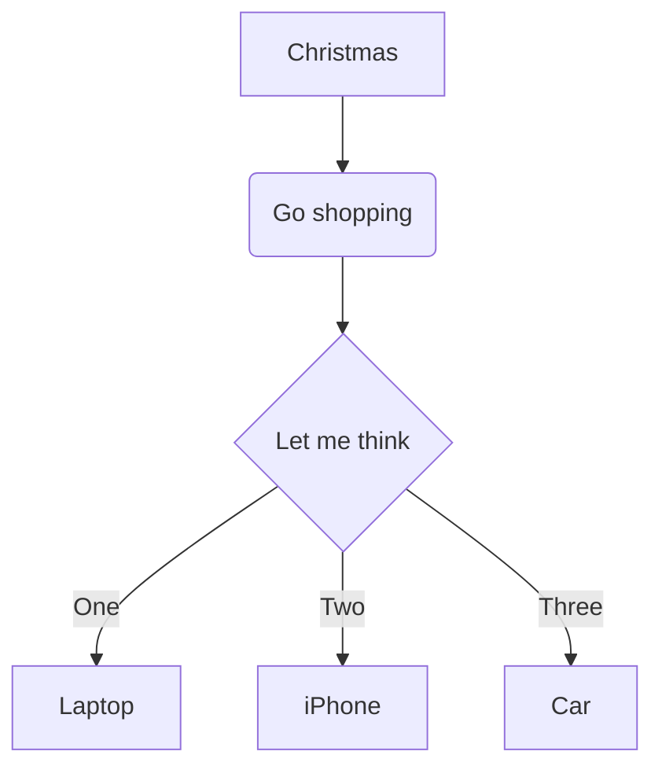
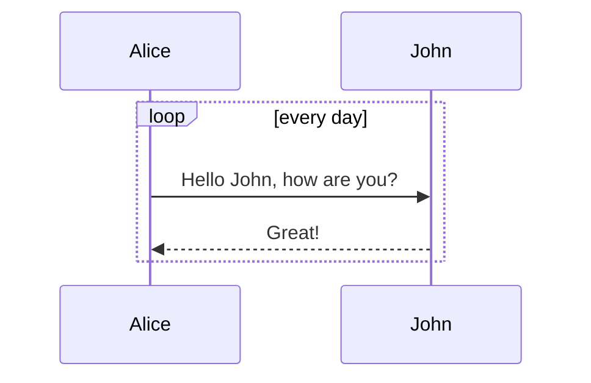
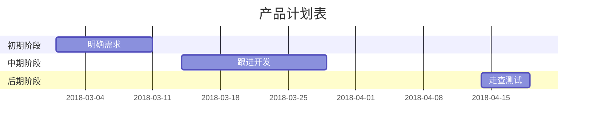
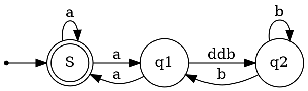

----
title: How to use markdown
tags: [markdown]
date: 2018-02-10 10:10:10
----

# 1.一级标题

## 1.1 二级菜单

### 1.1.1 三级菜单

#### 1.1.1.1 四级菜单

##### 1.1.1.1.1 五级菜单

###### 1.1.1.1.1.1 六级菜单

最多只能显示六级菜单了


# 制作待办事项To-do List  
- [x] 已完成项目1
  - [x] 完成的事件1
  - [ ] 未完成事件
- [x] 已完成的项目2
- [ ] 待办事项1
- [ ] 待办事项2

# 高效绘制 流程图、序列图、甘特图、表格
## 流程图


## 序列图


## 甘特图


## 表格

| 表头1       | 表头2         |
| :---------- | :------------ |
| row 1 col 1 | row 1 col 2   |
| row 2 col 1 | row 2 col   2 |


# 书写数学公式 ```$y = x^2```

## inline math 
```$\dfrac{
\tfrac{1}{2}[1-(\tfrac{1}{2})^n] }{
1-\tfrac{1}{2} } = s_n$
```

## math block:
```math
\oint_C x^3\, dx + 4y^2\, dy

2 = \left(
 \frac{\left(3-x\right) \times 2}{3-x}
 \right)

\sum_{m=1}^\infty\sum_{n=1}^\infty\frac{m^2\,n}
 {3^m\left(m\,3^n+n\,3^m\right)}
 
\phi_n(\kappa) = 
 \frac{1}{4\pi^2\kappa^2} \int_0^\infty
 \frac{\sin(\kappa R)}{\kappa R}
 \frac{\partial}{\partial R}
 \left[R^2\frac{\partial D_n(R)}{\partial R}\right]\,dR
```

## graphviz


## show code:
```javascript
  var ihubo = {
    nickName  : "草依山",
    site : "http://jser.me"
  }
```

# 列表

## 无须列表
- 列表1
  - 列表1.1
  - 列表1.2
- 列表2
- 列表3


* 列表11
    * 列表11.1
    * 列表11.2
    * 列表11.3
* 列表12
* 列表13


+   Red
+   Green
+   Blue


*   Lorem ipsum dolor sit amet, consectetuer adipiscing elit.
    Aliquam hendrerit mi posuere lectus. Vestibulum enim wisi,
    viverra nec, fringilla in, laoreet vitae, risus.
*   Donec sit amet nisl. Aliquam semper ipsum sit amet velit.
    Suspendisse id sem consectetuer libero luctus adipiscing.


*   Lorem ipsum dolor sit amet, consectetuer adipiscing elit.
Aliquam hendrerit mi posuere lectus. Vestibulum enim wisi,
viverra nec, fringilla in, laoreet vitae, risus.
*   Donec sit amet nisl. Aliquam semper ipsum sit amet velit.
Suspendisse id sem consectetuer libero luctus adipiscing.


列表项目可以包含多个段落，每个项目下的段落都必须缩进 4 个空格或是 1 个制表符：
1.  This is a list item with two paragraphs. Lorem ipsum dolor
    sit amet, consectetuer adipiscing elit. Aliquam hendrerit
    mi posuere lectus.

    Vestibulum enim wisi, viverra nec, fringilla in, laoreet
    vitae, risus. Donec sit amet nisl. Aliquam semper ipsum
    sit amet velit.

2.  Suspendisse id sem consectetuer libero luctus adipiscing.


如果要在列表项目内放进引用，那 > 就需要缩进：
*   A list item with a blockquote:

    > This is a blockquote
    > inside a list item.


如果要放代码区块的话，该区块就需要缩进两次，也就是 8 个空格或是 2 个制表符：

*   一列表项包含一个列表区块:  

        <代码写在这>


换句话说，也就是在行首出现数字-句点-空白，要避免这样的状况，你可以在句点前面加上反斜杠。  
1986\. What a great season.


## 有序列表
1. 列表1
    1. 列表1.1
    2. 列表1.2
    3. 列表1.3
    4. 列表1.4
2. 列表2
3. 列表3


# 引用
> 记录, 成为更好的自己。使用 > 开头保留一个字符空格


# 粗体和斜体
Markdown 的粗体和斜体也非常简单  
*我是一个斜体字体*  
**我是一个粗体字体**


# 链接与图片

## 链接
[百度官方网站](https://www.baidu.com) 

## 图标链接


# 分割线
分割线的语法只需要另起一行，连续输入三个星号 *** 即可分割两段文字内容  

这是第一段内容，你就建设认为这里有一片的内容
***
这是第二段内容，你就建设认为这里有一片的内容


# 特殊字符
&copy;  
&amp;  
4 < 5  


# 区块元素
[You can read this webside article](http://www.markdown.cn/)

## 段落和换行
一个 Markdown 段落是由一个或多个连续的文本行组成，它的前后要有一个以上的空行（空行的定义是显示上看起来像是空的，便会被视为空行。比方说，若某一行只包含空格和制表符，则该行也会被视为空行）。普通段落不该用空格或制表符来缩进。 

## 标题
利用 = （最高阶标题）和 - （第二阶标题）

this is an H1
==============

this is an H2
--------------


## 分割线
可以在一行中用三个以上的星号、减号、底线来建立一个分隔线，行内不能有其他东西。你也可以在星号或是减号中间插入空格  

* * *

***

*****

- - -

---------------------------------------


## 区段元素

### 链接
Markdown 支持两种形式的链接语法： 行内式和参考式两种形式。
不管是哪一种，链接文字都是用 [方括号] 来标记。

1. 要建立一个行内式的链接，只要在方块括号后面紧接着圆括号并插入网址链接即可，如果你还想要加上链接的 title 文字，只要在网址后面，用双引号把 title 文字包起来即可:

    This is [an example](http://example.com/ "Title") inline link.  
    [This link](http://example.net/) has no title attribute.

2. 如果你是要链接到同样主机的资源，你可以使用相对路径  
    See my [About](/about/) page for details.

3. 参考式的链接是在链接文字的括号后面再接上另一个方括号，而在第二个方括号里面要填入用以辨识链接的标记：  
    This is [an example][id] reference-style link.  
OR  
    This is [an example] [id] reference-style link.  
然后在文件的任意处，你可以把这个标记的链接内容定义出来：
    [id]: http://example.com/  "Optional Title Here"

4.链接的定义可以放在文件中的任何一个地方，我比较偏好直接放在链接出现段落的后面，你也可以把它放在文件最后面，就像是注解一样：
I get 10 times more traffic from [Google][1] than from
[Yahoo] [2] or [MSN] [3].

[1]: http://google.com/        "Google"
[2]: http://search.yahoo.com/  "Yahoo Search"
[3]: http://search.msn.com/    "MSN Search"


# markdown 使用工具

+ [Typora](https://typora.io/) 比较推荐的一款，可以边编辑边显示正确的格式


+ [visual studio code](https://code.visualstudio.com/) 需要安装 markdown 相关的插件
+ [atom](https://atom.io/) 需要安装相关的插件
+ [有道云笔记](http://note.youdao.com/) 有很好的在线功能


