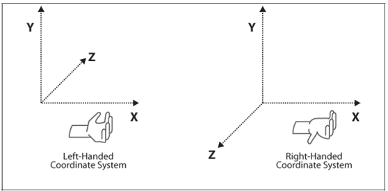

OpenGL 中的几个坐标系

可以参阅文章：
+ https://blog.csdn.net/loongkingwhat/article/details/82109216
+ https://blog.csdn.net/freehawkzk/article/details/81131710
+ https://www.cnblogs.com/aminxu/p/4441016.html

## 左右手坐标系

说明： 伸出大拇指方向指向你的正右方(该方位为 X 正方向), 伸出食指指向你的正上方(该方向为 Y 轴正方向), 以最舒适方式中指垂直与食指(中指指向的方向为 Z 轴正方向)。 左手形成的则为左手坐标系， 右手形成的是右手坐标系。

## 物体坐标系(Model Space)

指相对物体本身原点的坐标系统，原点坐标在物体本身上，又称之为局部坐标系。例如: 一个球体，它的模型坐标系或物体坐标系的原点可以在它的球心位置

## 世界坐标系(World Space)

用于表示物体在真实的三维空间中的坐标，世界坐标系的原点位置可以在空间中的任意位置，又称之为全局坐标系原点。通过将模型坐标系的原点经过旋转、平移等操作，可以将物体放到三维空间中的任意位置。

## 观察者坐标系(View Space)

View Space 又称 Camera 或者 Eye 坐标系没，指相对观察者的位置关系，