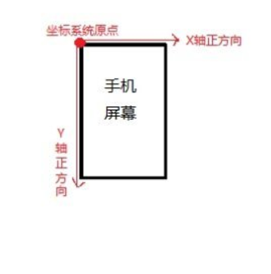
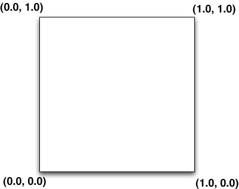
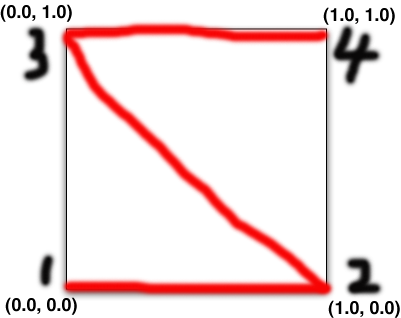
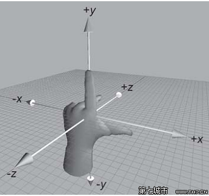
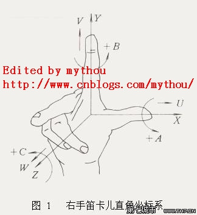

# android 坐标系

    屏幕左上点为原点，x轴向右，y轴向下，跟随屏幕方向变化而变化

# 纹理坐标系 (uv coordinates)

    2D 纹理坐标系也就是UV坐标系，水平方向是U，垂直方向是V，通过这个平面的，二维的UV坐标系。我们可以定位图象上的任意一个象素。左下角为原点，U轴向右，V轴向上，范围[0,1]。

见 具体有关 UV 贴图 [相关知识](https://www.cnblogs.com/jenry/p/4083415.html)

# 模型坐标系 (object coordinates)

## 左右手坐标系
    无论那只手大拇指指向你的右边(X轴正向)，食指指向你的上方(Y轴正向), 中指 食指 拇指 彼此自然垂直。 左手形成的坐标系为左手坐标系， 右手形成的坐标系为右手坐标系;

### 左手坐标系

### 右手坐标系

### 归一化定义与作用

*归一化* 要把需要处理的数据经过处理后（通过某种算法）限制在你需要的一定范围内。首先归一化是为了后面数据处理的方便，其次是保证程序运行时收敛加快。归一化的具体作用是归纳统一样本的统计分布性。归一化在0-1之间是统计的概率分布，归一化在某个区间上是统计的坐标分布。归一化有同一、统一和合一的意思。    

*归一化的目的* 使得没有可比性的数据变得具有可比性，同时又保持相比较的两个数据之间的相对关系，如大小关系；或是为了作图，原来很难在一张图上作出来，归一化后就可以很方便的给出图上的相对位置等。

    模型坐标系为归一化的右手坐标系，以模型内某一点为原点建立的坐标系，其它模型内的点的位置可以用相对于模型内的原点来表示的坐标系，该坐标系仅在模型内有效。

# 世界坐标系 (world coordinates)

    右手坐标系，屏幕中心点位原点x轴向右，y轴向上，z轴向屏幕外。可以理解为无限大的坐标系，用来描述物体或者光源的位置，跟随屏幕方向变化而变化。

# 视点(相机)坐标系 (eye coordinates)
在相机坐标系中，相机一直处于相机坐标系的原点，+x的方向是向右的，+z的方向是向前的(向屏幕里的方向，因为使用的是左手坐标系)，+y的方向是向上。这里的 *向上* 不是世界坐标的正上，而是一个相机的上方向.